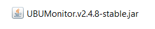
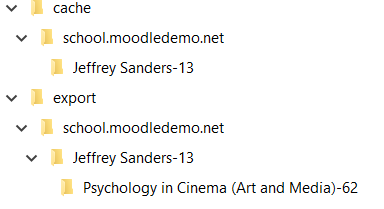

Anexos. Estructura de ficheros
==============================

A continuación se detalla la estructura de ficheros típica de UBUMonitor.

Contenido inicial 
-----------------

Si se instala la versión portable, inicialmente tendremos el siguiente contenido (el contenido con 32 bits es equivalente):

.. figure:: images/contenido_instalacion_portable_64bits.png
  :width: 400
  :alt: Login
  :align: center
  
  Contenido en una instalación portable (para 64 bits)
  
Si se instala la versión Java ejecutable con ``.jar`` tendremos el siguiente contenido:

  
  Contenido en la instalación con ejecutable Java .jar
  
Estructura de ficheros y directorios
------------------------------------

Una vez iniciada la aplicación, y descargados algunos cursos, nos encontraremos con los siguientes directorios y ficheros.

.. figure:: images/estructura_ficheros.png
  :width: 400
  :alt: Login
  :align: center
  
  Estructura de ficheros
  
Donde se crean los siguientes directorios:

* *cache*: el directorio contiene la caché local de los ficheros con los datos de los cursos descargados. 
* *export*: directorio donde se exportan los ficheros CSV.
* *log*: directorio donde se generan los ficheros registo o log de ejecución de la aplicación. Estos ficheros contienen los registros de ejecución y errores que se producen internamente en la aplicación. Son útiles para renviarlos a los desarrolladores para corregir los posibles errores o *bugs* que se produzcan en la aplicación.

La caché se organiza en un primer nivel por *host* y en un segundo nivel por usuario. En ese directorio se guarda un fichero por cada asignatura descargada (e.g. Moodle and Mountaineering (Physical Education)-51).

El directorio de exportación, se organiza de manera similar, incluyendo un subdirectorio adicional por curso para ubicar los ficheros ``.csv``. 
  

  
  Estructura de directorios y subdirectorios para la caché y exportación
  
Esta estructura de directorios permite acceder a distintos servidores Moodle desde UBUMonitor, evitando colisiones en el caso de coincidencia de nombres de usuario o de curso.