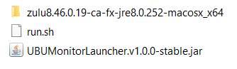
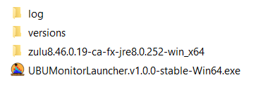
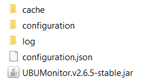

Anexos. Estructura de ficheros
==============================

A continuación se detalla la estructura de ficheros típica de UBUMonitor.

Contenido utilizando el instalador
----------------------------------

El instalador **UBUMonitorLauncher** genera la siguiente estructura de ficheros, dependiendo del sistema operativo.

**En Windows** se genera un directorio ``UBUMonitorLauncher.v1.0.0-stable-Win64-Portable`` (o equivalente para 32 bits) que contiene:

* Subdirectorio con el JRE: ``zulu8.46.0.19-ca-fx-jre8.0.252-win_x64`` (o versión equivalente para 32 bits)
* Fichero ejecutable: ``UBUMonitorLauncher.v1.0.0-stable-Win64.exe`` (o versión equivalente para 32 bits)

.. figure:: images/contenido_instalacion_portable_64bits.png
  :width: 350
  :alt: Contenido en Windows.
  :align: center
  
  Contenido en una instalación portable en Windows (para 64 bits)

**En GNU/Linux** se genera un directorio ``UBUMonitorLauncher.v1.0.0-stable-Linux64-Portable`` que contiene:

* Subdirectorio con el JRE: ``zulu8.46.0.19-ca-fx-jre8.0.252-linux_x64`` 
* Fichero ejecutable java: ``UBUMonitorLauncher.v1.0.0-stable.jar``
* Script de arranque: ``run.sh``

.. figure:: images/contenido_instalacion_portable_linux64bits.png
  :width: 350
  :alt: Contenido en GNU/Linux.
  :align: center
  
  Contenido en una instalación portable en GNU/Linux (para 64 bits)

Finalmente, **en Mac OS** se genera un directorio ``UBUMonitorLauncher.v1.0.0-stable-macOS64-Portable`` que contiene:

* Subdirectorio con el JRE: ``zulu8.46.0.19-ca-fx-jre8.0.252-macosx_x64`` 
* Fichero ejecutable java: ``UBUMonitorLauncher.v1.0.0-stable.jar``
* Script de arranque: ``run.sh``

  
  Contenido en una instalación portable en Mac OS (para 64 bits)
  
  
Estructura de ficheros y directorios
------------------------------------

Una vez iniciada la aplicación, descargados algunos cursos y cambiando la configuración por defecto, nos encontraremos con los siguientes directorios y ficheros adicionales (e.g. en Windows).

  
  Estructura de ficheros

* *log*: directorio donde se generan los ficheros registo o log de ejecución del *launcher*. Estos ficheros contienen los registros de ejecución y errores que se producen internamente en la aplicación de instalación y ejecución de UBUMonitor. Son útiles para renviarlos a los desarrolladores para corregir los posibles errores o *bugs* que se produzcan en la aplicación.
* *versions*: contiene la información básica de la aplicación que se detallará a continuación.
  

  
  Estructura del directorio versions
  
  
El directorio ``versions`` está formado por:

* *cache*: contiene la caché local de los ficheros con los datos de los cursos descargados. 
* *configuration*: almacena la configuración de la aplicación para el host, usuario y asignatura particular.
* *log*: directorio donde se generan los ficheros registo o log de ejecución de la aplicación UBUMonitor. Estos ficheros contienen los registros de ejecución y errores que se producen internamente en la aplicación. Son útiles para renviarlos a los desarrolladores para corregir los posibles errores o *bugs* que se produzcan en la aplicación.
* *configuration.json*: almacena las opciones de inicio personalizadas por el usuario (e.g. *Recordar usuario*, *Recordar host*, *Comprobar actualizaciones en el arranque*, *Recibir versiones de prueba*, etc.)
* *UBUMonitor.v2.6.5-stable.jar*: fichero ejecutable java al que se irán sumando las distintas versiones descargadas de la aplicación UBUMonitor con extensión ``.jar``. Inicialmente solo habrá un fichero (e.g. UBUMonitor.v2.6.5-stable.jar), pero a medida que se produzcan actualizaciones, se irán mostrando más ficheros descargados. Es importante mantener dichos ficheros para permitir al usuario recuperar a una versión previa de la aplicación.

El directorio ``cache`` se organiza en un primer nivel por *host*, en un segundo nivel por usuario y en un tercer nivel por la versión de modelo de datos utilizada (e.g. v.1.1). En ese directorio se guarda un fichero por cada asignatura descargada (e.g. *Psychology in Cinema (Art and Media)-62*). 

El directorio ``configuration`` se organiza en un primer nivel por *host*, en un segundo nivel por usuario. En cada directorio de usuario se almacena un fichero por asignatura con su configuración.
  
Esta estructura de directorios permite acceder a distintos servidores Moodle desde UBUMonitor, **evitando colisiones** en el caso de coincidencia de nombres de usuario o de curso.

**MUY IMPORTANTE**: las versiones portables incluyen un directorio con su propia distribución JRE (e.g. ``zulu8.46.0.19-ca-fx-jre8.0.252-win_x64``, ``zulu8.46.0.19-ca-fx-jre8.0.252-linux_x64``, etc.). Dicho directorio **no debe modificarse NUNCA**.