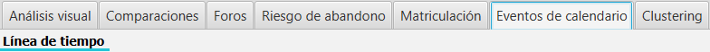

Eventos de calendario
=====================

Se incluye una pestaña adicional para la visualización de eventos de calendario.

  
  Eventos de calendario
  
Seleccionando los módulos de curso correspondientes, visualiza la línea de tiempo de los eventos generados para dichos módulos. La visualización de la información se divide por tipo de módulo. La línea roja vertical indica la fecha actual. 

El gráfico permite realizar zoom (e.g. utilizando la rueda del ratón) y arrastrar el gráfico (e.g. boton izquierdo arrastrandos sin soltar).

  
  Línea de tiempo
  
Si posicionamos el ratón sobre la barra o evento correspondiente, se muestra en un *tooltip* toda la información publicada y el tiempo calculado de duración.

