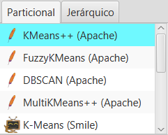
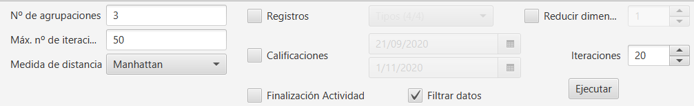
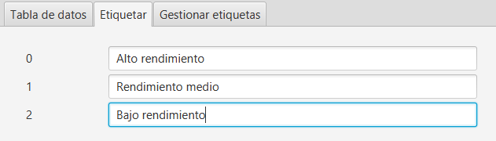

Clustering
==================

UBUMonitor incluye la funcionalidad de aplicar *clustering* o agrupación no supervisada de alumnos (y profesores), partiendo de los datos recogidos de logs, calificaciones y finalización de actividades. 

Dado lo complejo de esta sección y de los conceptos utilizados, su uso está recomenado para usuarios avanzados con cierta experiencia en el campo. Se recomienda revisar el concepto de `clustering <https://en.wikipedia.org/wiki/Cluster_analysis>`_ antes de abordar el uso de esta pestaña.

Al igual que el resto de pestañas, el funcionamiento está condicionado a la selección previa de usuarios, registros (en sus cuatro variantes de componente, evento, sección o módulo), elementos de calificación y finalización de actividades.

La ventana principal del clustering se muestra a continuación. 

  
  Ventana principal de clustering
  

Particional
-----------

El primer tipo de clustering disponible es el particional. Las instancias (alumnos o profesores) son particionados en grupos o clústeres en función de sus datos seleccionados.

En la esquina superior izquierda se puede seleccionar el algoritmo de clustering concreto a aplicar. Se incluyen los algoritmos de dos bibliotecas distintas:

* Algoritmos de Apache Math: se puede consultar su documentación en la seccion de `Machine Learning <https://commons.apache.org/proper/commons-math/userguide/ml.html>`_. Los algoritmos incluidos son:

	* KMeans++
	* Fuzzy-KMeans
	* DBSCAN
	* Multi-KMeans
	
* Algoritmos de SMILE: se puede consultar su documentación en línea en `Smile - Statistical Machine Intelligence and Learning Engine <https://haifengl.github.io/>`_. Los algoritmos incluidos son:

	* K-Means
	* X-Means
	* G-Means
	* DBSCAN
	

  
  Algoritmos de clustering particional

En función del algoritmo seleccionado, se muestran a la derecha los distintos parámetros a ajustar. Estos parámetros son diferentes para cada algoritmo.
 

  
  Opciones de configuración en clustering particional

Una vez seleccionado el algoritmo y ajustado sus parámetros particulares, es **muy importante indicar sobre qué datos se quieren utilizar**. Es obligatorio marcar al menos una de las opciones.

* **Registros**. Dentro de registros se puede indicar además:

	* Componentes
	* Eventos
	* Sección
	* Módulos curso
	
* **Calificaciones**
* **Finalización de actividad**

**Si no se ha seleccionado ningún tipo de datos** se informa con un **mensaje de error**. Es muy importante y necesario confirmar el tipo de datos concreto sobre el que se realizará el clustering.

  
  Selección de datos
  
Si queremos eliminar del análisis aquellas características con valores constantes para todos las instancias, se marcará la opción *Filtrar datos* (por defecto está marcada). Si además queremos reducir la dimensionalidad del conjunto de entrada, activaremos la opción Reducir dimensionalidad, indicando el número de características a reducir (se aplica PCA para reducir la dimensión del conjunto de entrada, aunque reduce tiempos de ejecución, probablemente provocará una pérdida de calidad en el agrupamiento).

Dado que muchos algoritmos tienen un carácter aleatorio en su inicialización, se permite indicar un número de iteraciones a realizar. Se repetirá la ejecución del algoritmo el número indicado quedándonos con el mejor resultado (según su análisis de silueta).

Como últimos valores a ajustar, están las fechas de inicio y fin para el filtrado de datos, permitiendo realizar el clustering sobre una vista temporal concreta.

Dado que el clustering es no supervisado, y en algunos algoritmos es necesario **sugerir el número de agrupaciones o clústeres manualmente**, se proporcionan dos métodos de inferencia del valor ideal, aunque no dejan de ser valores sugeridos. 

Se proporciona el gráfico del codo y el análisis del valor de silueta. Eligiendo en el desplegable uno de los dos métodos y presionando el botón *Analizar*, se genera el gráfico correspondiente para el número de agrupaciones máximo elegido en el *slider*. 
  

  
  Sugerencia de número de agrupaciones o clústeres
  
En el siguiente ejemplo se muestra el gráfico del codo.

.. figure:: images/codo.png
  :width: 400
  :alt: Ejemplo de gráfico de codo generado
  :align: center
  
  Ejemplo de gráfico de codo

Una vez ejecutado el algoritmo, y configuradas todas las opciones previas, pulsando en el botón *Ejecutar*, se realizará el clustering, visualizando la proyección 2D la nube de puntos en la subpestaña *Gráfico 2D*. Se indica en la leyenda el color asignado al clúster, el número de clúster y el número de instancias del total asignadas a dicho cluster. Adicionalmente en el gráfico se colorean en negro los centroides de cada clúster.

A la derecha del gráfico generado, se muestran las instancias clasificadas, mostrando su foto, apellidos, nombre y número de clúster asignado. Si seleccionamos el desplegable *Agrupaciones* en la parte superior, podemos seleccionar y filtrar solo los clústeres concretos que queremos mostrar.

  
  Clustering 2D

También se puede visualizar el resultado en una representación 3D del clustering previamente obtenido, en la subpestaña *Gráfico 3D*.

.. figure:: images/clustering_3d.png
  :width: 600
  :alt: Clustering 3D
  :align: center
  
  Clustering 3D

Para comprobar la corrección del clustering ejecutado, se muestran los indicadores en la subpestaña *Análisis de silueta*. En dicho gráfico, para cada instancia, se representa en una escala [-1,1] la adecuación del clúster asignado a cada instancia. Un valor 1 es un valor máximo ideal. Mientras que en la práctica ese valor oscilará entre [0,1] indicando que la instancia está peor o mejor asignada a ese clúster, y valores negativos indican que la instancia está definitivamente en un clúster equivocado.

  
  Análisis de silueta

Una vez obtenida una agrupación adecuada, mediante la exploración de las opciones previas, se pueden renombrar las etiquetas numéricas asignadas. Estas nuevas etiquetas de texto se actualizan dinámicamente en las gráficas generadas. Esto es importante, si se quieren exportar los datos, asignando clústeres con algo más de significado que los números iniciales. Una vez que hayamos concluido el etiquetado, presionando en el botón *Exportar CSV*, generamos un fichero con los datos del clustering para su análisis posterior con otras herramientas.

  
  Ejemplo de etiquetado de clústeres

A medida que vayamos añadiendo etiquetas, se nos permite una gestión limitada de las mismas, en la subpestaña *Gestionar etiquetas*.

  
  Gestión de etiquetas
  
Finalmente, si además hemos seleccionado elementos de calificación en la vista del calificador, se añadirán columnas adicionales a la derecha de la vista de resultados, mostrando las calificaciones en escala [0,100] (coloreando en rojo, amarillo, verde o morado de peores a mejores calificaciones), ayudando a identificar y sugerir el etiquetado de las instancias. Si marcamos la casilla *Exportar calificaciones* se añadirán esos datos en la exportación CSV.
  

  
  Resultado del clustering particional con datos de calificaciones 

Jerárquico
----------

El `agrupamiento jerárquico <https://en.wikipedia.org/wiki/Hierarchical_clustering>`_ utiliza un enfoque aglomerativo *bottom-up*. Cada instancia empieza en su propia agrupación, y empareja agrupaciones moviéndolas hacia arriba en la jerarquía. 

  
  Ventana de clustering jerárquico
  
Para realizar dichas agrupaciones utiliza dos parámetros ajustables:

* Medida de distancia
	
	* Euclidiana
	* Mahattan
	* Chebyshov
	
* Distancia entre agrupaciones
	
	* Conexión completa
	* Conexión simple
	* Conexión media
	* Conexión entre centroides
	* Conexión Ward
	
Para una descripción más detallada de dichas opciones consultar la documentacion en línea de su implementación en la `biblioteca SMILE <http://haifengl.github.io/api/java/smile/clustering/HierarchicalClustering.html>`_.

Al igual que en el clúster particional, es **muy importante indicar qué datos se quieren utilizar**. Es obligatorio marcar al menos una de las opciones.

* **Registros**. Dentro de registros se puede indicar además el tipo de datos a utilizar.

	* Componentes
	* Eventos
	* Sección
	* Módulos curso
	
* **Calificaciones**
* **Finalización de actividad**

**Si no se ha seleccionado ningún tipo de datos** se informa con un **mensaje de error**. Es muy importante y necesario confirmar el tipo de datos concreto sobre el que se realizará el clustering.

Como últimos valores a ajustar, están las fechas de inicio y fin para el filtrado de datos, permitiendo realizar el clustering sobre una vista temporal concreta de los mismos.

Configurados todos los parámetros y seleccionados los datos, se presionará el botón *Ejecutar* para realizar el clustering. En este proceso solo genera la representacion visual en árbol, denominada dendrograma.

  
  Dendrograma de la ejecución del clustering jerárquico
  
Si queremos generar un clustering concreto, debemos seleccionar ahora el número de agrupaciones y presionar el botón *Ejecutar* debajo de dicho número de clustering. Esto genera una división sobre el dendrograma, particionando las instancias en el número de clústeres indicado. Se visualizará en la parte de la derecha las instancias ya agrupadas, con las mismas opciones que en el clúster particional.

  
  Particionado sobre el dendrograma