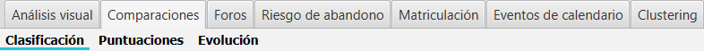
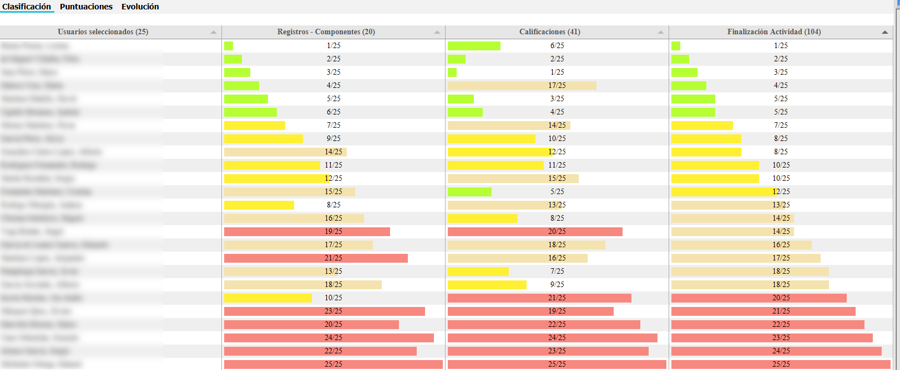
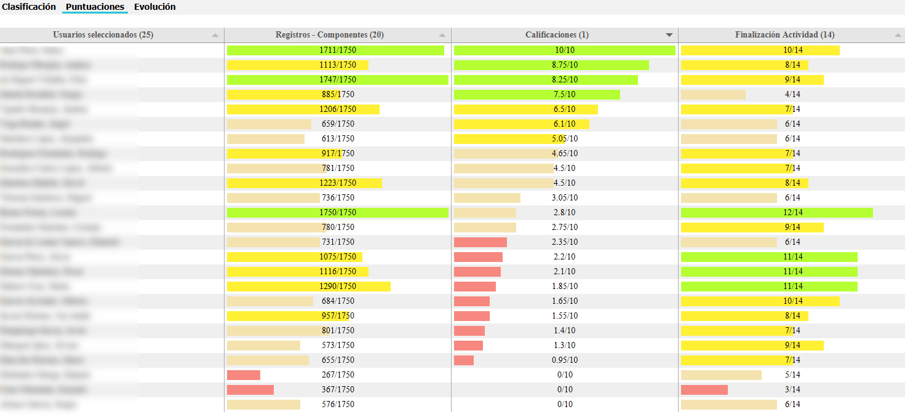
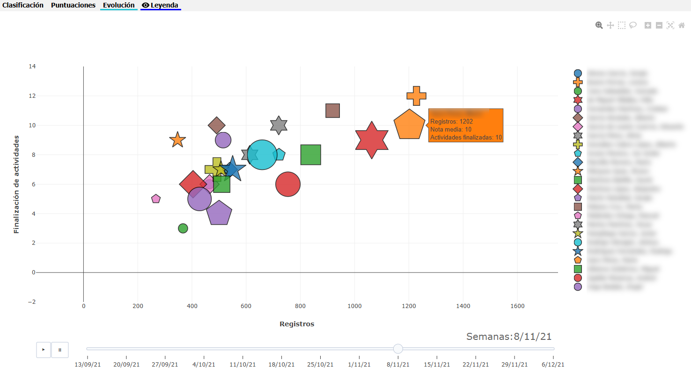

Comparaciones
=============

La aplicación contiene una pestaña para la comparación de estudiantes, en base a su número de registros, calificaciones y número de actividades finalizadas.

La pestaña incluye los siguientes gráficos.

  
  Gráficos de comparación

Clasificación
----------------------

Muestra una tabla con el **ranking** que ocupa cada alumno respeto a tres factores:

* Registros: número de registros en total.
* Calificaciones: media de las calificaciones seleccionadas.
* Finalización de actividades: número de actividades finalizadas.

Se muestra su **posición relativa en el ranking**, dentro del conjunto de estudiantes seleccionados, teniendo en cuenta los elementos en las pestañas de selección. 

Cuantos más registros, mejor calificación media o más actividades tiene finalizadas, mejor posición en el ranking. 

Por ejemplo 7/25 indica que está en la séptima posición dentro de los veinticinco estudiantes seleccionados. La mejor posición será siempre 1 y la peor, en este ejemplo, 25. Cuando hay coincidencia de posición o ranking, se asigna el mismo número, teniendo esto en cuenta en el cálculo de la siguiente posición no empatada. Esta opción se puede modificar en la configuración.

Se dibujan barras de colores relativas a su posición en el ranking, con cuatro niveles o colores.

En la parte superior de cada columna se muestra el número de componentes (eventos, secciones o módulos según la selección), calificaciones o actividades que están siendo analizadas.

El gráfico permite la ordenación ascendente o descendente de ranking por columnas. En la siguiente figura se ha ordenado ascendentemente por la primera columna, *Registros*, mostrando las primeras posiciones en el ranking en primer lugar.

  
  Gráfico de Clasificación (ordenado por Registros)
  
El gráfico permite una ordenación visual rápida y relacionar el rendimiento en esos tres factores en un solo vistazo.
  

Puntuaciones
------------

Muestra una tabla con las **puntuaciones** que ocupa cada alumno respeto a tres factores:

* Registros: número de registros, respeto al máximo de registros.
* Calificaciones: media de las calificaciones seleccionadas, respecto a la nota máxima.
* Finalización de actividades: número de actividades finalizadas, respecto al número de actividades seleccionadas.

Se muestra su posición relativa al máximo, dentro del conjunto de estudiantes seleccionados, teniendo en cuenta los elementos en las pestañas de selección. 

Por ejemplo, en registros tener 736/1750 indicaría que el estudiante tiene un número de registros de 736, mientras que el valor máximo alcanzado por algún estudiante en la selección actual es de 1750.

Se dibujan barras de colores relativas a la puntuación relativa al máximo, con cuatro niveles o colores.

En la parte superior de cada columna se muestra el número de componentes (eventos, secciones o módulos según la selección), calificaciones o actividades que están siendo analizadas.

El gráfico permite la ordenación ascendente o descendente por columnas. En la siguiente figura se ha ordenado descendentemente por la segunda columna, *Calificaciones*, mostrando las calificaciones más altas en primer lugar.

  
  Gráfico de Puntuaciones (ordenado por Calificaciones)

El gráfico permite una ordenación visual rápida y relacionar el rendimiento en esos tres factores en un solo vistazo.

Evolución
---------

Muestra en un gráfico **animado** la evolución en el tiempo de los estudiantes, respecto a sus datos de registros y finalización de actividades, agregando la calificación media.

En el eje x se toma como referencia el número de registros, y en el eje y el número de actividades finalizadas. El tamaño de la figura asignada a cada estudiante es relativo a su calificación media, a mayor calificación mayor tamaño. Estos tres datos pueden consultarse en el tooltip mostrado en cada una de las figuras.

No existen datos temporales de las calificaciones por lo que su nota media es constante respecto a la fecha de referencia final seleccionada.

Inicialmente todas las figuras están posicionadas en el punto (0,0). Una vez pulsado el botón de ejecución (play), se mueven las figuras en la franja de tiempo determinada, mostrando la evolución temporal relativa a sus registros y finalización de actividades. 

  
  Gráfico de evolución
  
El gráfico animado permite ver la *velocidad* o progreso en registros y finalización de actividades a lo largo de un periodo de tiempo. Posiciones más altas y a la derecha en el gráfico indican valores más altos, mientras que figuras que no se alejan del origen (0,0) muestran poca evolución e incluso peligro de abandono.