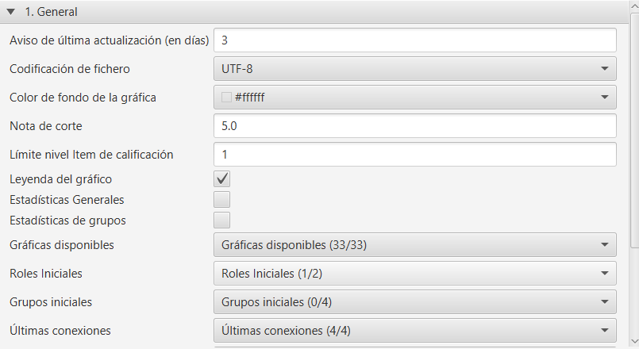
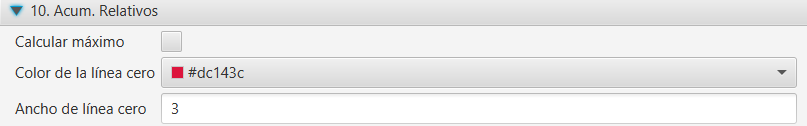
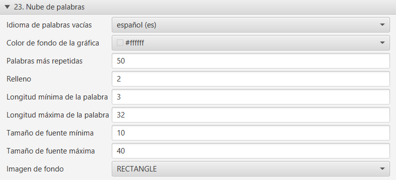

.. _configuration:

Configuración de la aplicación
==============================

En el menú **Herramientas**, se dispone de la opción avanzada **Cambiar configuración**. Esta opción permite personalizar los valores por defecto iniciales en algunas visualizaciones para la asignatura o curso actual (cada asignatura puede tener su propia configuración).

.. figure:: images/Configuracion_general_sin_abrir.png
  :width: 600
  :alt: Configuración
  :align: center
  
  Configuración

El diálogo modal de configuración habilita la búsqueda por texto. Los cambios se guardan al presionar el botón *Aplicar*. Si se quieren recupera los valores iniciales, se debe seleccionar el botón **Restaurar valores por defecto**.

El dialógo muestra las siguientes secciones organizadas por pestañas:

General
-------

* Codificación del fichero: juego de caracteres a utilizar en la exportación de los ficheros ``CSV`` generados.
* Color de fondo de la gráfica: por defecto está en transparente, pero puede personalizarse.
* Nota de corte: mínima nota que marca superar o no los items de calificación.
* Límite nivel Item de calificación: indica el nivel de profundidad en el árbol del calificador al que se muestran los items y categorías de calificación desplegados. A mayor valor, el árbol mostrará los elementos a niveles más profundos desplegados.
* Ancho de línea
* Espaciado entre líneas
* Leyenda del gráfico
* Estadísticas generales
* Estadísticas de grupos
* Gráficas disponibles: se pueden seleccionar qué gráficas se visualizan o no. Por defecto están marcadas todas.
* Roles iniciales: selección de roles que se marcan inicialmente en el filtro por roles. Por defecto se marca el rol alumno.
* Grupos iniciales: selección de grupos que se marcan inicialmente en el filtro de grupos. Por defecto no están seleccionados.
* Últimas conexiones: selección de última conexión que se marca inicialmente en el filtro. Por defecto están marcadas todas.
* Unidad de tiempo predeterminado
* Título del eje Y
* Título del eje X
* Color de fuente eje Y
* Color de fuente eje X

  
  Configuración general
  
  
Total (Pestaña Análisis visual - Registros)
-------------------------------------------
* Modo horizontal: cambia la visualización de las barras a modo horizontal.

  
  Total

Barras apiladas (Pestaña Análisis visual - Registros)
-----------------------------------------------------

* Calcular máximo: activa el cálculo automático.

  
  Barras apiladas

Heatmap (Pestaña Análisis visual - Registros)
---------------------------------------------

* Calcular máximo: activa el cálculo automático.
* Con cuartiles: calcula los rangos a partir de los cuartiles de la muestra actual, en lugar de dividir el rango en cuatro partes iguales.
* Valor cero
* Primer intervalo
* Segundo intervalo
* Tercer intervalo
* Cuarto intervalo
* Máximo

.. figure:: images/Configuracion_heatmap.png
  :width: 600
  :alt: Heatmap
  :align: center
  
  Heatmap
  

Boxplot de elementos (Pestaña Análisis visual - Registros)
----------------------------------------------------------

* Modo horizontal: cambia la visualización del boxpot a modo horizontal.

  
  Boxplot por tiempos
  
  
Violín de elementos (Pestaña Análisis visual - Registros)
---------------------------------------------------------

* Modo horizontal: cambia la visualización del violín a modo horizontal.

  
  Violín por tiempos
  

Boxplot por tiempos (Pestaña Análisis visual - Registros)
---------------------------------------------------------

* Modo horizontal: cambia la visualización del boxplot a modo horizontal.

  
  Boxplot por tiempos
  

  
Violín por tiempos (Pestaña Análisis visual - Registros)
--------------------------------------------------------

* Modo horizontal: cambia la visualización del violín a modo horizontal.

  
  Violín por tiempos

Acumulados (Pestaña Análisis visual - Registros)
------------------------------------------------

* Calcular máximo: activa el cálculo automático.

.. figure:: images/Configuracion_acumulados.png
  :width: 600
  :alt: Acumulados
  :align: center
  
  Acumulados
  

Acum. Relativos (Pestaña Análisis visual - Registros)
-----------------------------------------------------

* Calcular máximo: activa el cálculo automático.
* Color de línea cero: color aplicado a la línea que representa la media
* Ancho de línea cero

  
  Acumulados relativos
  
  
Sesión (Pestaña Análisis visual - Registros)
--------------------------------------------

Configura el tiempo máximo en minutos de duración de la sesión web en el servidor Moodle.

  
  Sesión
  

Boxplot (Pestaña Análisis visual - Calificaciones)
--------------------------------------------------

* Modo horizontal: cambia la visualización de los boxplot a modo horizontal.
* Información de decimales: número de decimales a mostrar en los *tooltips* con los datos estadísticos.

.. figure:: images/Configuracion_boxplot.png
  :width: 600
  :alt: Boxplot
  :align: center
  
  Boxplot

Violín (Pestaña Análisis visual - Calificaciones)
-------------------------------------------------

* Modo horizontal: cambia la visualización de los violines a modo horizontal.
* Información de decimales: número de decimales a mostrar en los *tooltips* con los datos estadísticos.

.. figure:: images/Configuracion_violin.png
  :width: 600
  :alt: Violín
  :align: center
  
  Violín

Calificaciones (Pestaña Análisis visual - Calificaciones)
---------------------------------------------------------

* Color de calificación suspensa: teniendo en cuenta la nota de corte configurada en la sección General.
* Color de calificación aprobada: teniendo en cuenta la nota de corte configurada en la sección General.

.. figure:: images/Configuracion_calificaciones.png
  :width: 600
  :alt: Calificaciones
  :align: center
  
  Calificaciones

Calificaciones % (Pestaña Análisis visual - Calificaciones)
-----------------------------------------------------------

* Modo horizontal: cambia la visualización a modo horizontal.
* Color de calificación vacía
* Color de calificación suspensa: teniendo en cuenta la nota de corte configurada en la sección General.
* Color de calificación aprobada: teniendo en cuenta la nota de corte configurada en la sección General.

.. figure:: images/Configuracion_calificaciones_porcentaje.png
  :width: 600
  :alt: Porcentaje de calificaciones
  :align: center
  
  Porcentaje de calificaciones

Finalización Actividad (Pestaña Análisis visual - Actividades finalizadas)
--------------------------------------------------------------------------

Configura los colores para los distintos intervalos de la barra de progreso.

  
  Finalización Actividad
  
  
Compromiso (Lineal) (Pestaña Riesgo de abandono)
------------------------------------------------

* Límite de días: establece el límite superior en días para el abandono.
* Configura los colores para los gráficos de compromiso lineal.

  
  Compromiso lineal
  
Compromiso (Logarítmico) (Pestaña Riesgo de abandono)
-----------------------------------------------------

Configura los colores para los gráficos de compromiso logarítmico.

  
  Compromiso logarítmico
  
Barras (Pestaña Foros)
-----------------------

* Modo horizontal: cambia la visualización a modo horizontal.
* Foros: color de las barras utilizadas.

  
  Barras

Mensajes de usuario (Pestaña Foros)
-----------------------------------

* Debates creados: color de las barras utilizadas para los debates.
* Mensajes de réplicas: color de las barras utilizadas para las réplicas.
* Modo horizontal: cambia la visualización a modo horizontal.

  
  Mensajes de usuario

Grafo (Pestaña Foros)
---------------------

* Mostrar nodos sin aristas: oculta la visualizacion de nodos que no tengan aristas entrantes o salientes.
* Usar fotos: oculta la visualización de fotos en los nodos.
* Usar iniciales de nombres: oculta la visualización de las iniciales de apellidos y nombre en el nodo.
* Mostrar número de mensajes:

El resto de opciones son relativas a la física de desplazamiento de nodos, dibujado de aristas y colocación de nodos en pantalla. 

  
  Grafo

Árbol (Pestaña Foros)
---------------------

* Usar fotos: oculta la visualización de fotos en los nodos.
* Color de nodos filtrados: color de nodos seleccionados que participan.
* Color de nodos no filtrados: color de nodos no seleccionados pero que participan en la conversación.
* Nodos -> Ancho borde: ancho de borde.
* Aristas -> Borde: grosor de borde.
* Interacción -> Teclado: permitir interacción con teclado.
* Interacción -> Multiselección: permitir la selección con la teclar CTRL.
* Interacción -> Botones de navegación: ocultar botones de navegación.
* Interacción -> Retardo tootip: número de milisegundos en el retardo en mostrar el tooltip.

  
  Árbol de conversación

Nube de palabras (Pestaña Foros)
--------------------------------

* Idioma de palabras vacías: selección del idioma para la lista de palabras vacías.
* Color de fondo de la gráfica: color de fondo de la gráfica, por defecto en transparente.
* Palabras más repetidas: número de palabras más repetidas a incluir.
* Relleno: espacio entre palabras.
* Longitud mínima de la palabra: longitud mínima de las palabras a incluir en la nube.
* Longitud máxima de la palabra: longitud máxima de las palabras a incluir en la nube.
* Tamaño de fuente mínima: tamaño mínimo de fuente.
* Tamaño de fuente máxima: tamaño máximo de fuente.
* Imagen de fondo: imagen de fondo como plantilla para rellenar con las palabras.

  
  Nube de palabras

