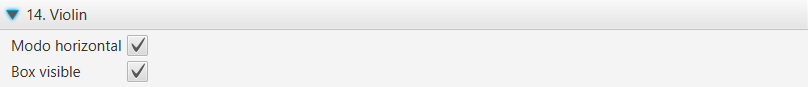
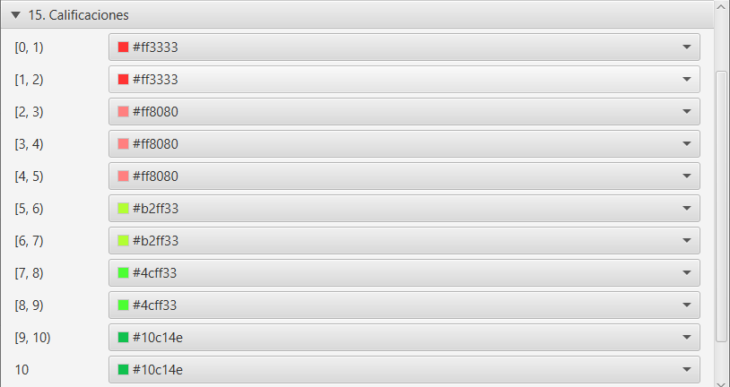

.. _configuration:

Configuración de la aplicación
==============================

En el menú **Herramientas**, se dispone de la opción avanzada **Cambiar configuración**. Esta opción permite personalizar los valores por defecto iniciales en algunas visualizaciones para la asignatura actual (cada asignatura puede tener su propia configuración).

  
  Configuración

El diálogo modal de configuración habilita la búsqueda por texto. Los cambios se guardan al cerrar el diálogo. Si se quieren recupera los valores iniciales, se debe seleccionar el botón **Restaurar valores por defecto**.

El dialógo muestra las siguientes secciones:

General
-------

* Codificación del fichero: juego de caracteres a utilizar en la exportación de los ficheros ``CSV`` generados.
* Nota de corte: mínima nota que marca superar o no los items de calificación.
* Ancho de línea
* Espaciado entre líneas
* Leyenda del gráfico
* Estadísticas generales
* Estadísticas de grupos
* Roles iniciales: selección de roles que se marcan inicialmente en el filtro por roles.
* Grupos iniciales: selección de grupos que se marcan inicialmente en el filtro de grupos.
* Últimas conexiones: selección de última conexión que se marca inicialmente en el filtro.
* Unidad de tiempo predeterminado
* Título del eje Y
* Título del eje X
* Color de fuente eje Y
* Color de fuente eje X

.. figure:: images/Configuracion_general.png
  :width: 600
  :alt: Configuración general
  :align: center
  
  Configuración general

Barras apiladas
---------------

* Calcular máximo: activa el cálculo automático.

.. figure:: images/Configuracion_barras_apiladas.png
  :width: 600
  :alt: Barras apiladas
  :align: center
  
  Barras apiladas

Heatmap
-------

* Calcular máximo: activa el cálculo automático.
* Con cuartiles: calcula los rangos a partir de los cuartiles de la muestra actual, en lugar de dividir el rango en cuatro partes iguales.
* Valor cero
* Primer intervalo
* Segundo intervalo
* Tercer intervalo
* Cuarto intervalo
* Máximo

  
  Heatmap

Total
-----
* Modo horizontal: cambia la visualización de las barras a modo horizontal.

.. figure:: images/Configuracion_total.png
  :width: 600
  :alt: Total
  :align: center
  
  Total

Acumulados
----------

* Calcular máximo: activa el cálculo automático.

  
  Acumulados

Acum. Relativos
---------------

* Calcular máximo: activa el cálculo automático.
* Color de línea cero: color aplicado a la línea que representa la media
* Ancho de línea cero

.. figure:: images/Configuracion_acumulados_relativos.png
  :width: 600
  :alt: Acumulados relativos
  :align: center
  
  Acumulados relativos

Boxplot
-------

* Modo horizontal: cambia la visualización de los boxplot a modo horizontal.
* Información de decimales: número de decimales a mostrar en los *tooltips* con los datos estadísticos.

  
  Boxplot

Violín
------

* Modo horizontal: cambia la visualización de los violines a modo horizontal.
* Información de decimales: número de decimales a mostrar en los *tooltips* con los datos estadísticos.

  
  Violín

Calificaciones
--------------

* Color de calificación suspensa: teniendo en cuenta la nota de corte configurada en la sección General.
* Color de calificación aprobada: teniendo en cuenta la nota de corte configurada en la sección General.

  
  Calificaciones

Calificaciones %
----------------

* Color de calificación vacía
* Color de calificación suspensa: teniendo en cuenta la nota de corte configurada en la sección General.
* Color de calificación aprobada: teniendo en cuenta la nota de corte configurada en la sección General.

  
  Porcentaje de calificaciones

Finalización Actividad
----------------------

Configura los colores para los distintos intervalos de la barra de progreso.

.. figure:: images/Configuracion_finalizacion_actividad.png
  :width: 600
  :alt: Finalización de actividad
  :align: center
  
  Finalización Actividad
