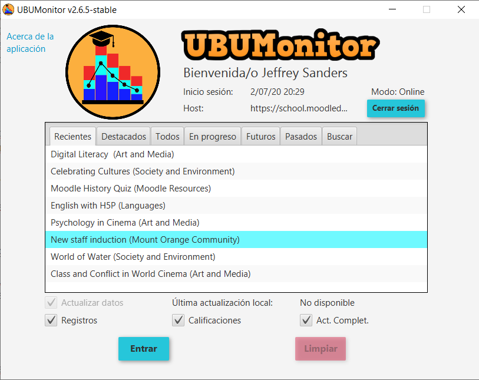
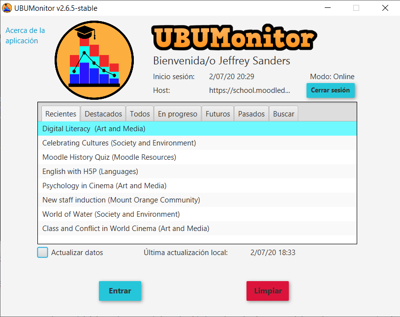

Selección de curso/asignatura
=============================

En esta pantalla muestra un listado de cursos (o asignaturas) en los que está registrado el usuario actual. Se  permite seleccionar uno de ellos, para realizar la carga de datos y acceder a la siguiente pantalla. 

Cuando se elige uno de los cursos, se muestra la información de fecha de la Última actualización local. Esta fecha indica la última actualización de datos, realizada en dicho curso (se muestra en función del fichero local de caché).  

Si queremos forzar actualizar los datos, con el contenido actual del servidor, debemos marcar la opción de **Actualizar datos**. En caso contario se mostrarán los datos de la caché local que estarán desactualizados.

Si el curso nunca ha sido cargado previamente se mostrará **No disponible** y se marca por defecto la opción de **Actualizar datos**.

  
  Selección de asignatura (curso) en primer acceso
  
Cuando se haya seleccionado un curso y pulsamos en el botón **Entrar**, si la casilla de **Actualizar datos** está seleccionada, cargará el fichero en local (o lo crea, en caso de que no exista)  y actualiza los datos (usuarios matriculados, calificaciones, registros, etc...) conectándose con el servidor Moodle.

Este proceso de descarga de datos del calificador y registro (log) puede tardar varios minutos, mostrando en la parte inferior una barra de progreso indicando las etapas realizadas (carga del calificador, descarga del log y actualización del mismo).

Si no está marcada la opción **Actualizar datos**, abre directamente el fichero de la caché local y lo carga de forma casi instantánea. Se recuerda que el fichero local se cifra usando la contraseña de Moodle como clave, por motivos de seguridad. 

En siguientes accesos a cursos previamente cargados, se mostrará ya la fecha de última actualización y se dará la opción de marcar o no la opción **Actualizar datos**.

  Acceso posterior a asignatura cargada previamente
  
Si la carga de datos ha sido correcta, se pasará a mostrar la ventana principal de la aplicación.
  
Contraseña modificada
---------------------

En el caso de que se haya modificado la contraseña de Moodle recientemente, se muestra una ventana emergente, indicando que se ha detectado un cambio en la contraseña y pide la anterior contraseña, que se tuviera en la fecha señalada.

.. figure:: images/contraseña_antigua.png
  :width: 400
  :alt: Login
  :align: center
  
  Cambio de contraseña
  
Cuando se haya introducido correctamente la contraseña antigua, el fichero en caché local se guarda con la nueva. Esto es debido a que la información siempre se guarda encriptada.

**MUY IMPORTANTE**: es necesario recordar la contraseña previa, para poder recuperar los datos. En caso contrario se debe borrar manualmente la caché, para forzar a cargar los cursos nuevamente.