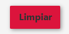
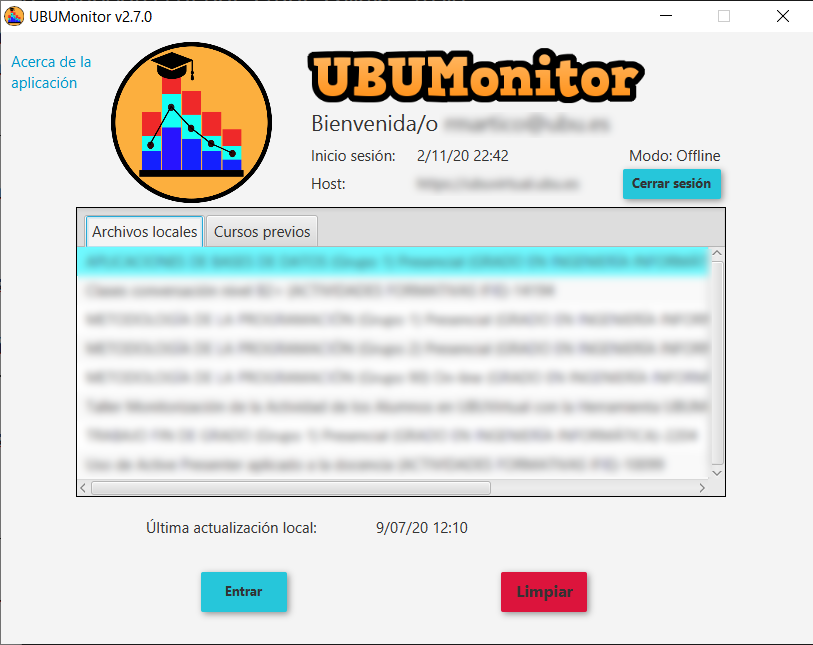
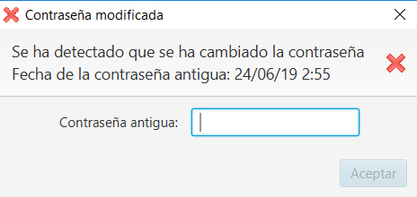

Selección de curso/asignatura
=============================

En la parte superior se muestra el usuario, url del host, fecha de inicio de sesión y el modo de trabajo (online vs. offline). El botón **Cerrar sesión** permite volver a la ventana de inicio de sesión previa, cerrando la actual.

La zona principal muestra el listado de cursos (o asignaturas) en los que está registrado el usuario actual. Se  permite seleccionar uno de ellos, para realizar la carga de datos y acceder a la siguiente pantalla. Las asignaturas se presentan ordenadas alfabéticamente en pestañas (a excepción de la pestaña *Recientes*) de la siguiente forma:

* **Recientes**: cursos accedidos recientemente por el usuario.
* **Destacados**: cursos destacados por el usuario.
* **Todos**: conjunto completo de cursos en el que el usuario está matriculado.
* **En progreso**: en curso actual, con fecha de inicio y fin incluyendo a la fecha actual.
* **Futuros**: cursos a realizar, con fecha de inicio posterior a la fecha actual.
* **Pasados**: cursos ya finalizados, con fecha de fin anterior a la fecha actual.
* **Buscar**: incluye un buscador por texto para encontrar cualquier curso en el servidor Moodle.

*Nota*: es responsabilidad del usuario clasificar las asignaturas como *destacadas* (e incluso *ocultas*) en su *Área personal* de Moodle. Las fechas de inicio y fin de cada curso, se personalizan en *Editar ajustes* de cada asignatura.

.. figure:: images/Seleccion_de_curso.png
  :width: 400
  :alt: Selección de curso en primer acceso
  :align: center
  
  Selección de curso (asignatura) en primer acceso

La primera vez que se selecciona un curso se mostrará en **Última actualización local** el texto **No disponible** y se marca por defecto la opción de **Actualizar datos** para forzar la descarga de datos del servidor. 

Dependiendo de los permisos actuales de nuestro usuario sobre el curso seleccionado y de las opciones activadas en el curso, se muestran en las casillas inferiores las opciones de datos disponibles a actualizar: registros (logs), calificaciones y actividades completadas. Discrecionalmente se pueden marcar o no, para recargar los respectivos datos. Si el usuario no tiene permisos o los datos no están disponibles para su descarga, la casilla simplemente se deshabilita.

Presionamos el botón **Entrar** para iniciar la descarga. Este proceso de descarga de datos puede **tardar varios minutos en la primera descarga** (en función del número de alumnos, tamaño del calificador, número de registros nuevos y de actividades con rastreo de finalización activo). Se dispone de un botón *Cancelar* para interrumpir el proceso de carga.

Se mostrará en la parte inferior una barra de progreso indicando las etapas realizadas (descarga de datos, del calificador, de finalización de actividades,del log y parseado de logs). **Posteriores actualizaciones serán más breves**, puesto que la carga de registros es incremental, aunque el calificador y la finalización de actividades siempre se actualiza por completo.

Por otro lado, es **MUY IMPORTANTE** que en el calificador esté visible la información de porcentaje (por defecto está visible en Moodle) para una correcta lectura y visualización posterior de las calificaciones.

Finalizada la descarga se pasará a mostrar la ventana principal de la aplicación.

Actualización de datos
----------------------

En posteriores accesos a cursos previamente cargados, se mostrará ya la fecha de **Última actualización local** y se dará la opción de marcar, o no, la opción **Actualizar datos**.  

Si queremos forzar la actualización de datos con el contenido actual del servidor, debemos marcar manualmente dicha opción. En caso contario, se cargaran y mostrarán los datos de la caché local (que pudieran estar desactualizados).

.. figure:: images/Seleccion_de_curso_recargar_asignatura.png
  :width: 400
  :alt: Selección de curso recargando asignatura
  :align: center

  Acceso posterior a asignatura cargada previamente
  
Limpieza de cache
-----------------

Seleccionando una asignatura previamente cargada, se activará el botón **Limpiar**. Dicho botón permite borrar la caché local de nuestra instalación actual de UBUMonitor.

  Limpiar caché

Al desaparecer la caché, la asignatura se detecta como no cargada previamente, forzando siempre a utilizar la opción **Actualizar datos** en el siguiente acceso posterior.  

Esta opción es útil para eliminar ficheros de asignaturas a las que ya no se va acceder en el futuro.

..
	Esta opción es útil para eliminar ficheros de asignaturas a las que ya no se va acceder en el futuro o cuando la versión instalada de UBUMonitor detecte problemas con la versión de fichero local y sea necesario su borrado (ver Sec. :ref:`errormessages`).

Modo offline
------------

Si hemos seleccionado acceso en **Modo offline** solo se mostrarán las asignaturas disponibles en la caché local, en la pestaña *Archivos locales*. En este modo no es posible actualizar datos, pero sí acceder a la funcionalidad completa de análisis visual de datos.

  
  Selección de curso (asignatura) offline

  
Contraseña modificada
---------------------

En el caso de que se haya modificado la contraseña de Moodle recientemente, se muestra una ventana emergente, indicando que se ha detectado un cambio y pide la anterior contraseña, que se tuviera en la fecha señalada.

  
  Cambio de contraseña
  
Cuando se haya introducido correctamente la contraseña antigua, el fichero en caché local se encripta y guarda con la nueva contraseña. Esto es **obligatorio**, debido a que la información **siempre se guarda encriptada**.

**MUY IMPORTANTE**: es necesario recordar la contraseña previa, para poder recuperar los datos. En caso contrario se debe limpiar la caché (botón **Limpiar**), para forzar a cargar los cursos nuevamente.