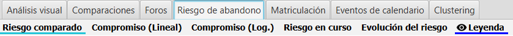

Riesgo de abandono
==================

En esta versión se incluye una pestaña adicional para el análisis del riesgo de abandono. La pestaña incluye los siguientes gráficos.

  
  Gráficos de riesgo de abandono
  
En estos gráficos se analiza el **compromiso de los alumnos con la asignatura** analizando sus **fechas de último acceso** a la asignatura y a la plataforma Moodle. 

Para la generacion de estos gráficos **solo se utilizan los datos de los usuarios seleccionados**, ignorando el resto de filtros aplicados en logs, calificaciones o finalizacion de actividades.  

 
Riesgo comparado
----------------

Se muestra un gráfico de barras por pares. Se utilizan cuatro categorías o colores: 

* verdes para accesos entre 0 a 2 días.
* azules para accesos entre 3 a 6 días.
* amarillos para accesos entre 7 a 13 días.
* rojos para accesos de más de 14 días.

En cada par de columnas se muestra:

* en un color más suave el número y porcentaje de alumnos que han accedido en esa franja de tiempo al **curso**.
* en un color más oscuro se muestra  el número y porcentaje de alumnos, pero en relación al último acceso a **Moodle**.

Esto permite comparar el acceso al curso frente a la plataforma Moodle, pudiendo ver casos en los que no se accede al curso, pero sí se está accediendo a Moodle (al menos, a alguno de los otros cursos).

  
  Riesgo comparado

Compromiso (Lineal)
-------------------

Este gráfico de burbujas representa en el eje X el tiempo relativo al acceso al curso y en el eje Y el tiempo de acceso a Moodle. Cada burbuja representa el número de alumnos en esos intervalos de tiempos. El radio de la burbuja es proporcional al número de alumnos.

Se utiliza una codificación de colores verde, amarillo y rojo para indicar el nivel de alejamiento del alumno de menos a más.

Este gráfico tienen la particularidad de que *no mostrará valores por encima de la diagonal*, puesto que ningún alumno puede tener un valor menor de acceso al curso que a Moodle (el acceso al curso implícitamente conlleva el acceso a Moodle).

  
  Compromiso lineal

Se genera un triángulo de burbujas donde:

* Cuantas más burbujas verdes y con mayor radio tengamos próximas al punto de origen (0,0), implica un mayor compromiso en la asignatura.
* Las burbujas más hacia la derecha, implican que el alumno se desengancha de la asignatura, alejándose del punto (0, 0).
* Las burbujas que se van mostrando más cerca de la diagonal, implican que el alumno también se desengancha de Moodle.
* Cuantas más burbujas rojas tengamos en la zona de laesquina superior derecha, significa que tenemos más alumnos que abandonan la asignatura y Moodle (todos los cursos en los que estuviese matriculado). Esto últimos casos implican no solo un abandono de la asignatura sino de la titulación.

La paleta de colores puede configurarse a gusto del usuario. Ver Sec :ref:`configuration`, en el apartado **Compromiso (Lineal)**.

Compromiso (Log.)
-----------------

Este gráfico de burbujas representa en el eje X el tiempo relativo al acceso al curso y en el eje Y el tiempo de acceso a Moodle, pero utilizando una **escala logarítmica en ambos ejes**. Cada burbuja representa el número de alumnos en esos intervalos de tiempos. El radio de la burbuja es proporcional al número de alumnos.

Se utiliza una codificación de colores verde, amarillo y rojo para indicar el nivel de alejamiento del alumno de menos a más.

Al igual que el gráfico previo, *no mostrará valores por encima de la diagonal*, puesto que ningún alumno puede tener un valor menor de acceso al curso que a Moodle (el acceso al curso implícitamente conlleva el acceso a Moodle).

  
  Compromiso logarítmico
  
La interpretacion se realiza de manera similar al gráfico previo, teniendo en cuenta el cambio de escala. La paleta de colores puede configurarse por el usuario. Ver Sec :ref:`configuration`, en el apartado **Compromiso (Log.)**.

Riesgo en curso
---------------

Muestra un gráfico de barra con la instantánea de abandono en un momento dado. Para el cálculo del número de alumnos/porcentaje se utilizan los logs dentro del rango de fechas establecido.

  
  Riesgo en curso

Utilizando dichas fechas, podemos generar la visualización de riego de abandono en cualquier momento de tiempo concreto en nuestro curso.

Evolución del riesgo
--------------------

Muestra un gráfico de líneas apiladas, mostrando la evolución temporal del compromiso a lo largo de un periodo de tiempo. Se puede agrupar temporalmente (e.g. semanas, meses, etc.) trabajando con los valores medios.

Se muestran las cuatro líneas correspondientes a:

* verdes para accesos entre 0 a 2 días
* azules para accesos entre 3 a 6 días
* amarillos para accesos entre 7 a 13 días
* rojos para accesos de más de 14 días

  
  Evolución del riesgo
  
La suma de valores en la vertical, siempre debe coincidir con el total de alumnos matriculados.

