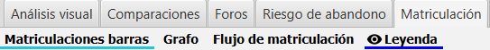
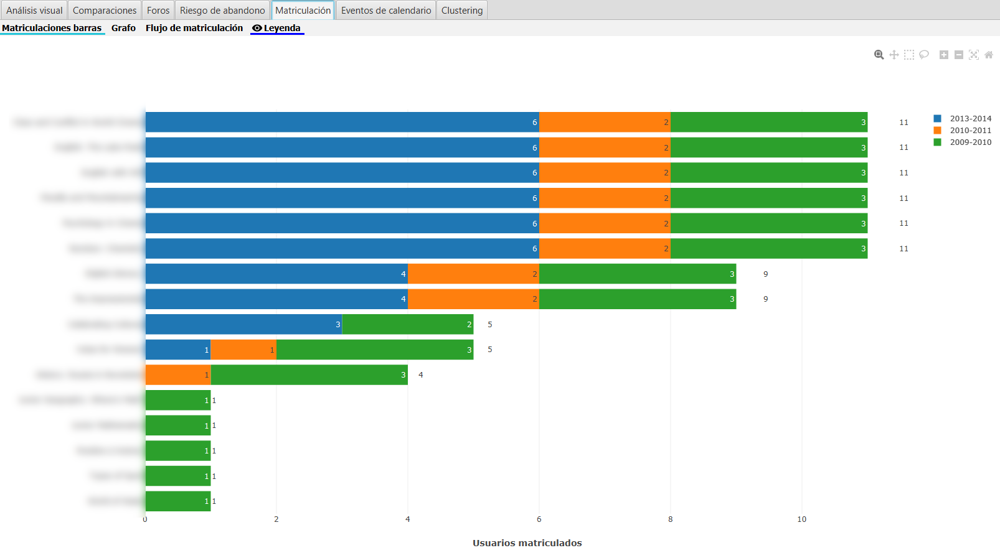
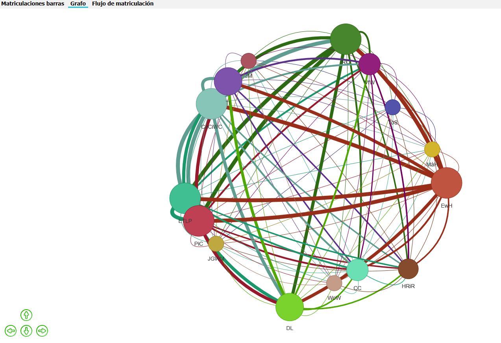
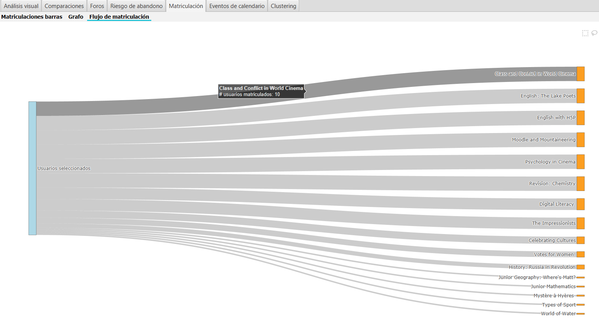

Matriculación
=============

La aplicación contiene una pestaña para el análisis visual de la matriculación actual del alumnado. Tomando como referencia el curso actual, se analiza y muestra en número de dichos alumnos que están matriculados en otros cursos. Se completa el análisis por cohorte de entrada.

La pestaña incluye los siguientes gráficos.

  
  Gráficos de matriculación

*Nota: el año de primera matriculación que determina la cohorte se estima con el primer acceso a Moodle, pudiendo ser este un dato impreciso en el caso de cambio de titulación o incorporación desde otras titulaciones previas en el mismo centro.*

Barras de matriculaciones
-------------------------

Muestra un gráfico de barras, desglosado por cohorte de entrada, con el total de estudiantes matriculados en el curso actual y en otros cursos. El valor máximo se localizará habitualmente en el curso actual (aunque puede haber otros cursos con coincidencia en el conjunto de estudiantes matriculados).

El gráfico permite visualizar el conjunto de otras asignaturas que están cursando actualmente los estudiantes que conforman el curso actual bajo análisis. 

Por otro lado la visualización de la barra desglosada por cohortes permite analizar el número de estudiantes que cursan la asignatura en el año previsto o no. 

Los datos pueden no ser coincidentes al 100% con el número de veces en que se han matriculado, puesto que se toma como referencia la fecha primer acceso a Moodle, y no los datos administrativos del matriculación en las asignaturas del centro.

  
  Barra de matriculaciones

Grafo de matriculación
----------------------

Muestra un grafo donde los nodos representan todos los cursos matriculados de los estudiantes, en el curso actual. Los arcos no dirigidos representan el número de estudiantes que están cursando ambos cursos actualmente, dando una medida de la fuerza de la conexión entre cursos (o nodos). 

Los nodos reciben un nombre compuesto por las iniciales de la denominación de la asignatura en Moodle. 

El tamaño del nodo y grosor del arco son proporcionales al número de estudiantes matriculados en el curso y estudiantes en común entre ambos cursos, respectivamente.

Posicionando el ratón encima de un nodo se puede visualizar la lista de estudiantes matriculados. 

Dependiendo de su activación en las opciones de configuración se puede mostrar igualmente la lista de estudiantes comunes sobre los arcos.

  
  Grafo de matriculaciones

El gráfico permite una visión rápida de las conexiones actuales entre asignaturas, dentro del diseño curricular establecido, y siempre sobre el conjunto de estudiantes seleccionados.

Flujo de matriculación
----------------------

Muestra en un gráfico de Sankey, el flujo de matriculados de los estudiantes seleccionados entre el total de asignaturas en las que están matriculados.

  
  Flujo de matriculaciones