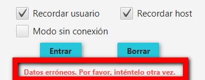
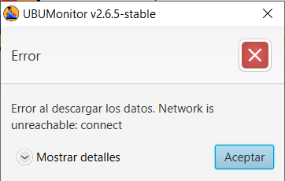
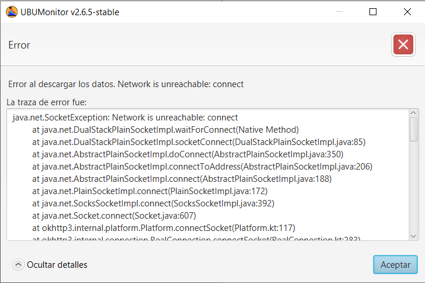
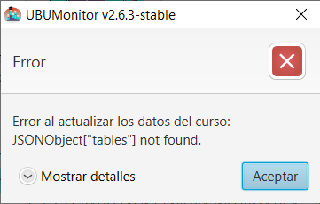
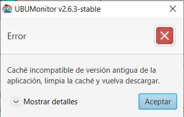

.. _errormessages:

Mensajes de error
=================

La aplicación mostrará los distintos mensajes de error, con dos formatos básicos de visualización: mensaje incrustado en ventana o diálogo modal de error. 

Mensaje en ventana
------------------

Se muestran en rojo en la parte inferior de la ventana activa. Se producen por una incorrecta introducción de datos. En la figura se muestra el error al iniciar sesión con un usuario y/o contraseña incorrectos. 

  
  Error en la validación de usuario
 
Otro ejemplo, en la siguiente figura, nos muestra el mensaje correspondiente si no hay conexión a red, informando de que no es posible la conexión al host indicado.
  

  
  Error por falta de conexión a red en validación
  
Diálogo de error
----------------

Se abre un diálogo modal con un texto descriptivo del error y la opción a desplegar de **Mostrar detalles**. En la siguiente figura vemos un ejemplo de error al perder la conexión de red a la hora de cargar una asignatura.

  
  Error en conexión en red al cargar asignatura
  
Si seleccionamos la opción **Mostrar detalles**, se abre un cuadro de texto en la parte inferior del diálogo, con la traza del error. 

  
  Detalles del error en conexión en red al cargar asignatura
  
La información mostrada en el cuadro de texto es técnica, y aunque no es de interés para el usuario, es **MUY IMPORTANTE** remitir ese texto a los desarrolladores para la corrección de errores o bugs de la aplicación (se puede seleccionar y copiar el texto directamente).

Errores habituales
------------------

**Sin permisos de profesor**

Un error habitual es que no se tengan permisos de profesor (o profesor no editor) sobre un curso o comunidad en el que sí se está matriculado. En tales casos se mostrará un mensaje como el siguiente:

  
  Error al cargar una asignatura sin rol de profesor

**Versión de caché incompatible**

Si intentamos cargar una asigntura de la caché, cuyo fichero de datos fue generado con una versión diferente de UBUMonitor, puede producirse un error al ser incompatible con la versión actual. En tales casos, se debe limpiar la cache (botón **Limpiar**) y descargar los datos de nuevo.

  
  Error al cargar una asignatura de la caché con versión incompatible
