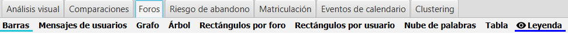
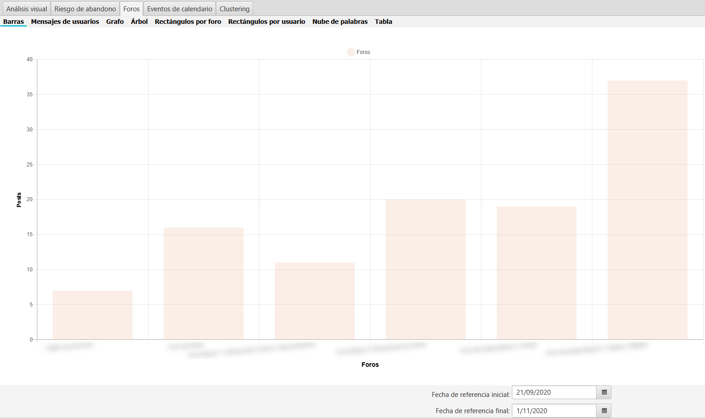
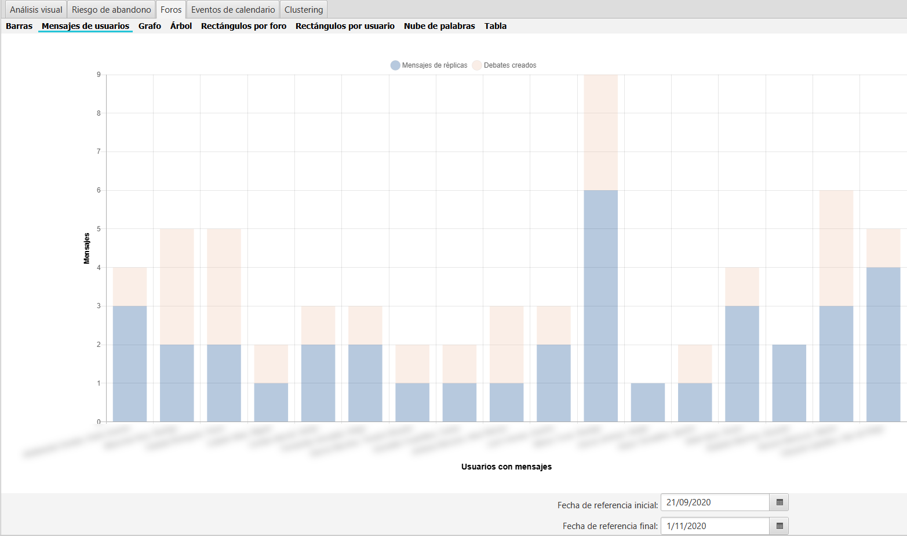

Foros
=====

La aplicación contiene una pestaña para el análisis visual de los foros. La pestaña incluye los siguientes gráficos.

  
  Gráficos de foros
  
En estos gráficos se analiza el uso e interacción de los alumnos y profesores en los distintos foros. Para la generacion de estos gráficos **solo se utilizan los datos de los usuarios y foros seleccionados**. 

En todos estos gráficos se puede aplicar el filtrado por fechas, seleccionando solo aquellos mensajes en el intervalo de tiempo especificado.

 
Barras
------

Muestra un gráfico de barras con el **número de mensajes** por foros. Esto permite comparar la actividad en cada foro de la asignatura, desde un punto de vista global. 

  
  Mensajes por foro

La paleta de colores y la orientación del gráfico, puede configurarse a gusto del usuario. Ver Sec :ref:`configuration`, en la pestaña **Foros** en el apartado **Barras**.

Mensajes de usuario
-------------------

Muestra un gráfico de barras apiladas desglosado con el **número de réplicas y de debates** creados por cada usuario. Solo se muestran columnas para aquellos usuarios seleccionados que hayan generado algún mensaje en los foros seleccionados.

  
  Mensajes de usuario

La paleta de colores para réplicas y debates, junto con la orientación del gráfico, puede configurarse a gusto del usuario. Ver Sec :ref:`configuration`, en la pestaña **Foros** en el apartado **Mensajes de usuario**.

Grafo
-----

Visualiza el **grafo de interacción** entre los usuarios y foros seleccionados. Cada nodo representa un usuario del cual se puede opcionalmente mostrar su foto e iniciales. Las aristas tienen origen en el usuario que envía el mensaje y finalizan con una punta de flecha en el usuario que lo recibe. Si un usuario se envía un mensaje en contestación a un mensaje suyo previo, se representa con una arista con origen y fin en el mismo nodo, finalizando en un arco en lugar de una punta de flecha.

Para cada nodo se indican los siguientes datos: número de mensajes enviados, número de mensajes recibidos, número de mensajes enviados a sí mismo y número de debates iniciados. Si alguno de estos datos es cero, simplemente no se mostrará.

Los tamaños de los nodos y el grosor de las aristas es proporcional al número de mensajes.

.. figure:: images/Grafo.png
  :width: 600
  :alt: Grafo
  :align: center
  
  Grafo

Dado que es el gráfico **más interactivo** de los incluidos en UBUMonitor, se recomienda experimentar directamente con la interacción que proporciona.

Muchas de las opciones de visualización pueden configurarse a gusto del usuario. Ver Sec :ref:`configuration`, en la pestaña **Foros** en el apartado **Grafos**. Se recomienda consultar todas las opciones de configuración, puesto que es el gráfico más completo en cuanto a las posibles opciones de configuración como por ejemplo ocultar nodos sin aristas, ocultar fotos, mostrar iniciales, etc.

Árbol
-----

Muestra el **árbol o árboles** correspondientes a los foros y usuarios seleccionados. El árbol muestra la **secuencia de intercambio de mensajes en el tiempo** entre los usuarios. Si posicionamos el curso encima de un nodo, se muestra la información y texto del mensaje correspondiente (Nota: no se muestran las imágenes adjuntas en el mensaje, puesto que no pueden extraerse de Moodle).

  
  Árbol
  
Si alguno de los usuarios que participan en la conversación, no han sido seleccionados o dicho mensaje queda fuera del intervalo de fechas seleccionado, se muestra en color rojo.

La paleta de colores utilizada, el uso de fotos, y cuestiones relativas a la interacción gráfica, pueden configurarse a gusto del usuario. Ver Sec :ref:`configuration`, en la pestaña **Foros** en el apartado **Árbol**.

Rectángulos por foro
--------------------

Muestra un gráfico de tipo *treemap* representando las areas proporcionales al número de mensajes, organizado en un primer nivel por foro y luego por usuario. El gráfico muestra visualmente la participación en cada foro de los usuarios.

  
  Rectángulos por foro
  

Rectángulos por usuario
-----------------------

Muestra un gráfico de tipo *treemap* representando las areas proporcionales al número de mensajes, organizado en un primer nivel por usuario y luego por foro. El gráfico muestra visualmente la participación de cada usuario en los distintos foros.

  
  Rectángulos por usuario

Nube de palabras
----------------

Analiza el texto y la frecuencia de aparición de palabras para los foros y usuarios seleccionados, mostrando dichas palabras con un tamaño relativo a su frecuencia. Esto permite detectar cuáles son los términos más frecuentemente discutidos en los foros. 

  
  Nube de palabras

La nube de palabras es muy configurable. Se puede seleccionar el idioma para el filtrado de palabras vacías, color de fondo de la gráfica, imagen de fondo como plantilla para colocar las palabras, tamaños, etc. Todas estas cuestiones pueden configurarse a gusto del usuario. Ver Sec :ref:`configuration`, en la pestaña **Foros** en el apartado **Nube de palabras**.

Tabla
-----

Muestra la tabla cruzada de **número de mensajes cruzados entre los usuarios**. En la columna de la izquierda están los usuarios que envían el mensaje y en las columnas los usuarios que reciben el mensaje. El número indicado en una casilla muestra el número de mensajes del usuario colocado en dicha fila al usuario colocado en el encabezado de la columna correspondiente. Si el número de mensajes es cero, no se muestra ningún valor.

  
  Tabla
  
Como en el resto de visualizaciones, los datos de esta tabla son exportables en formato CSV para su posterior análisis.