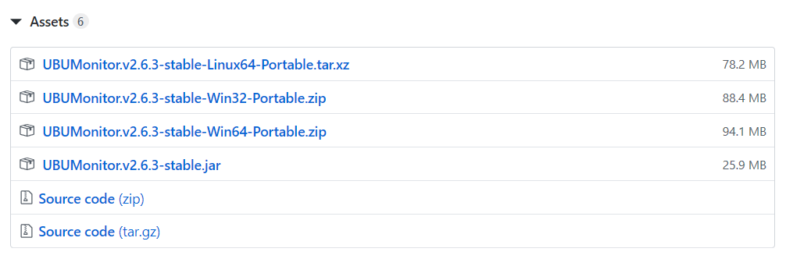

Instalación y arranque
======================

Para instalar el programa, descargar la última versión disponible en: https://github.com/yjx0003/UBUMonitor/releases/latest.

Se mostrará una entrada similar a la siguiente, desplegando el elemento **Assets** (*Nota: los números de versión irán cambiando en un futuro según evolucione el producto*):

  Descarga desde GitHub de UBUMonitor

Se muestran los posibles ficheros a descargar para su ejecución (y desarrollo con los códigos fuentes). Para su instalación solo interesan los siguientes ficheros:

* ``UBUMonitor.v2.6.3-stable-Linux64-Portable.xz``: versión portable para sistema operativo GNU/Linux 64 bits.
* ``UBUMonitor.v2.6.3-stable-Win32-Portable.zip``: versión portable para sistema operativo Windows 32 bits.
* ``UBUMonitor.v2.6.3-stable-Win64-Portable.zip``: versión portable para sistema operativo Windows 64 bits.
* ``UBUMonitor.v2.6.3-stable.jar``: versión multiplataforma ejecutable con Java instalado en el sistema operativo. Versión para Windows, GNU/Linux o Mac.

Se ofrecen dos versiones: 

* Versión portable (con mínima instalación) para **Windows** (descomprimiendo el fichero .zip) y **GNU/Linux** (descomprimiendo el fichero .xz). 
* Versión fichero ejecutable java (con extensión ``.jar``) para **TODAS** las plataformas.

**Se recomienda utilizar la versiones portables por encontrarse optimizados los ejecutables y scripts para su ejecución, así como contener la versión de Java y JavaFX con la que ha sido testada la aplicación en desarrollo.**

Versión portable para GNU/Linux
-------------------------------

Si se trabaja en GNU/Linux, y no se quiere instalar Java en el equipo actual (o no se quiere cambiar la configuración), se sugiere descargar la versión portable de 64 bits. 

Pasos para su instalación:

* Copiar el fichero descargado con sufijo ``-Portable.tar.xz`` a un directorio a libre elección del usuario, donde tenga permisos de escritura y ejecución.
* Descomprimir el fichero con sufijo ``-Portable.tar.xz`` correspondiente con alguna herramienta tipo tar, gzip, bzip2, etc. Por ejemplo: ``tar -Jxf UBUMonitor.v2.6.3-stable-Linux64-Portable.tar.xz``.
* En el directorio generado al descomprimir, ejecutar el script ``run.sh``. Puede ser necesario dar permisos de ejecución a dicho script con el comando ``chmod +x run.sh``.

*Nota: las versiones portables incluyen dentro del fichero ``tar.xz`` un JRE 8 con JavaFX, por eso ocupan más espacio.*

Versión portable para Windows
-----------------------------

Si se trabaja en Windows, y no se quiere instalar Java en el equipo actual (o no se quiere cambiar la configuración), se sugiere descargar la versión portable que corresponda, según el sistema operativo sea de 32 o 64 bits. 

Pasos para su instalación:

* Copiar el fichero descargado con sufijo ``-Portable.zip`` a un directorio a libre elección del usuario, donde tenga permisos de escritura y ejecución.
* Descomprimir el fichero con sufijo ``-Portable.zip`` correspondiente con alguna herramienta tipo WinZip, 7Zip, WinRar, etc.
* En el directorio generado al descomprimir, hacer doble click sobre el fichero ejecutable con extensión ``.exe`` (e.g. ``UBUMonitor.v2.6.3-stable-Win64.exe``)

*Nota: las versiones portables incluyen dentro del fichero ``.zip`` un JRE 8 con JavaFX, por eso ocupan más espacio.*

Versión ejecutable con Java 8
-----------------------------

Si no se quiere o puede usar la versión portable, es requisito tener instalada una versión del entorno de ejecución(JRE) de Java 8. En particular la distribución oficial de `Oracle que incluye las bibliotecas de JavaFX <https://www.oracle.com/java/technologies/javase-jre8-downloads.html>`_ o bien versiones como `Zulu con FX <https://www.azul.com/downloads/zulu-community/>`_. Con versiones posteriores **NO** funcionará correctamente, así como tampoco con versiones libres (e.g. OpenJDK, AdoptOpenJDK, Amazon Correto, etc.) que no incluyan las bibliotecas de JavaFX (habría que instalar JavaFX adicionalmente).
 
Suponiendo que se tiene ya instalada dicha versión Java 8 (y que es la versión de Java activa) se siguen los siguientes pasos:

#. Copiar el fichero ``.jar`` a un directorio donde el usuario tenga permisos de escritura y ejecución.
#. Probar a ejecutar haciendo doble click sobre el fichero ``.jar``.  

Si Java está asociado correctamente a la extensión ``.jar`` se ejecutar la aplicación.
Si no, ejecutar desde una consola del sistema operativo, en el directorio donde se tenga el fichero ``.jar`` lo siguiente: 
   
* ``$> java -jar UBUMonitor.v2.6.3-stable.jar``

*Nota: el número de versión puede ir cambiando.*

Si todo va correcto se iniciará la ejecución de la aplicación. En caso contrario, verificar de nuevo los pasos previos.