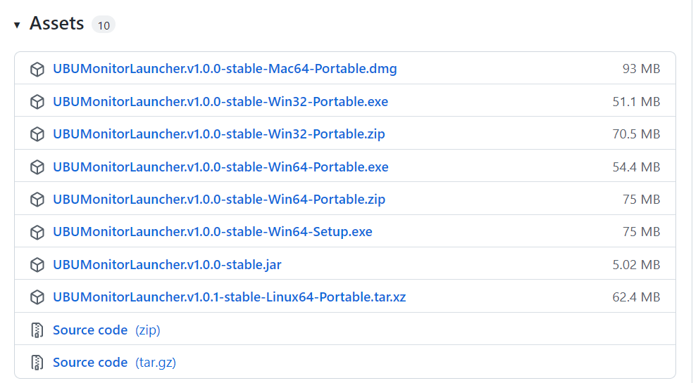
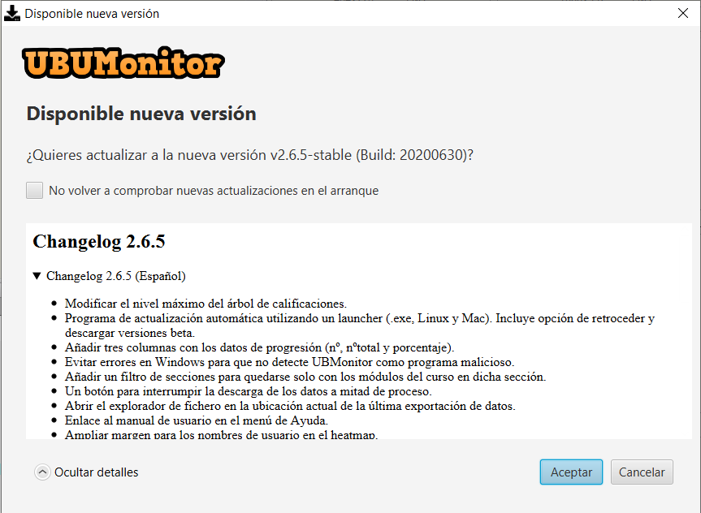

Instalación y arranque
======================

Desde la versión 2.6.5 de UBUMonitor, se distribuye un **instalador** que descarga la última versión disponible de UBUMonitor. En siguientes ejecuciones comprobará si existen nuevas versiones disponibles, y en caso de existir, consultará al usuario si quiere actualizar la aplicación. Se puede consultar el vídeo de instalación en: https://www.youtube.com/watch?v=hEX1UJBEFlY

Para descargar el instalador acceder a: https://github.com/yjx0003/UBUMonitorLauncher/releases/latest.

..
	Para instalar el programa, descargar la última versión disponible en: https://github.com/yjx0003/UBUMonitor/releases/latest.

Se mostrará una entrada similar a la siguiente, desplegando el elemento **Assets** (*Nota: los números de versión irán cambiando en un futuro según evolucione el producto*):

  Descarga desde GitHub de UBUMonitorLauncher

Se muestran los posibles ficheros a descargar para su ejecución (y desarrollo con los códigos fuentes). Para su instalación solo interesan los siguientes ficheros:

* ``UBUMonitorLauncher.v1.0.0-stable-Linux64-Portable.xz``: versión portable para sistema operativo GNU/Linux 64 bits.
* ``UBUMonitorLauncher.v1.0.0-stable-macOS64-Portable.xz``: versión portable para sistema operativo Mac OS 64 bits.
* ``UBUMonitorLauncher.v1.0.0-stable-Win32-Portable.zip``: versión portable para sistema operativo Windows 32 bits.
* ``UBUMonitorLauncher.v1.0.0-stable-Win32-Portable.exe``: versión portable autoextraíble para sistema operativo Windows 32 bits.
* ``UBUMonitorLauncher.v1.0.0-stable-Win64-Portable.zip``: versión portable para sistema operativo Windows 64 bits.
* ``UBUMonitorLauncher.v1.0.0-stable-Win64-Portable.exe``: versión portable autoextraíble para sistema operativo Windows 64 bits.
* ``UBUMonitorLauncher.v1.0.0-stable.jar``: versión multiplataforma ejecutable con Java instalado en el sistema operativo. Versión para Windows, GNU/Linux o Mac.

..
	* ``UBUMonitor.v2.6.3-stable-Linux64-Portable.xz``: versión portable para sistema operativo GNU/Linux 64 bits.
	* ``UBUMonitor.v2.6.3-stable-Win32-Portable.zip``: versión portable para sistema operativo Windows 32 bits.
	* ``UBUMonitor.v2.6.3-stable-Win64-Portable.zip``: versión portable para sistema operativo Windows 64 bits.
	* ``UBUMonitor.v2.6.3-stable.jar``: versión multiplataforma ejecutable con Java instalado en el sistema operativo. Versión para Windows, GNU/Linux o Mac.

Se ofrecen las siguientes versiones: 

* Versión portable (con mínima instalación) para **Windows** (descomprimiendo el fichero ``.zip``), **GNU/Linux** y **Mac OS** (descomprimiendo el fichero ``.xz``). 
* Versión portable autoextraíble si no se dispone de un descompresor (con mínima instalación) para **Windows**, ejecutando directamente ficheros con extensión ``.exe``. 
* Versión fichero ejecutable java (con extensión ``.jar``) para **TODAS** las plataformas.

**Se recomienda utilizar la versiones portables o autoextraíbles, por encontrarse optimizados los ejecutables y scripts para su ejecución, así como contener la versión de Java y JavaFX con la que ha sido testada la aplicación en desarrollo.**

Versión portable para GNU/Linux
-------------------------------

Si se trabaja en GNU/Linux, y no se quiere instalar Java en el equipo actual (o no se quiere cambiar la configuración), se sugiere descargar la versión portable de 64 bits. 

Pasos para su instalación:

* Copiar el fichero descargado con sufijo ``-Portable.xz`` a un directorio a libre elección del usuario, donde tenga permisos de escritura y ejecución.
* Descomprimir el fichero con sufijo ``-Portable.xz`` correspondiente con alguna herramienta tipo tar, gzip, bzip2, etc. Por ejemplo: ``tar -Jxf UBUMonitorLauncher.v1.0.0-stable-Linux64-Portable.xz``.
* En el directorio generado al descomprimir, ejecutar el script ``run.sh``. Puede ser necesario dar permisos de ejecución a dicho script con el comando ``chmod +x run.sh``.

*Nota: las versiones portables incluyen dentro del fichero ``.xz`` un JRE 8 con JavaFX, por eso ocupan más espacio.*

Versión portable para Mac OS
----------------------------

Si se trabaja en Mac OS, y no se quiere instalar Java en el equipo actual (o no se quiere cambiar la configuración), se sugiere descargar la versión portable de 64 bits. 

Pasos para su instalación:

* Copiar el fichero descargado con sufijo ``-Portable.xz`` a un directorio a libre elección del usuario, donde tenga permisos de escritura y ejecución.
* Descomprimir el fichero con sufijo ``-Portable.xz`` correspondiente con alguna herramienta tipo tar, gzip, bzip2, etc. Por ejemplo: ``tar -Jxf UBUMonitorLauncher.v1.0.0-stable-macOS64-Portable.xz``.
* En el directorio generado al descomprimir, ejecutar el script ``run.sh``. Puede ser necesario dar permisos de ejecución a dicho script con el comando ``chmod +x run.sh``.

*Nota: las versiones portables incluyen dentro del fichero ``.xz`` un JRE 8 con JavaFX, por eso ocupan más espacio.*

Versión portable para Windows
-----------------------------

Si se trabaja en Windows, y no se quiere instalar Java en el equipo actual (o no se quiere cambiar la configuración), se sugiere descargar la versión portable que corresponda, según el sistema operativo sea de 32 o 64 bits. 

Pasos para su instalación:

* Copiar el fichero descargado con sufijo ``-Portable.zip`` a un directorio a libre elección del usuario, donde tenga permisos de escritura y ejecución.
* Descomprimir el fichero con sufijo ``-Portable.zip`` correspondiente con alguna herramienta tipo WinZip, 7Zip, WinRar, etc.
* En el directorio generado al descomprimir, hacer doble click sobre el fichero ejecutable con extensión ``.exe`` (e.g. ``UBUMonitorLauncher.v1.0.0-stable-Win64.exe``)

*Nota: las versiones portables incluyen dentro del fichero ``.zip`` un JRE 8 con JavaFX, por eso ocupan más espacio.*

Versión portable autoextraíble para Windows
-------------------------------------------

Si se trabaja en Windows,no se quiere instalar Java en el equipo actual (o no se quiere cambiar la configuración) y además **no se tiene instalado un software de descompresión (e.g. 7z, Winzip, Winrar, etc.)**, se sugiere descargar la versión portable autoextraíble con extensión ``.exe`` que corresponda, según el sistema operativo sea de 32 o 64 bits. 

Pasos para su instalación:

* Copiar el fichero descargado con sufijo ``-Portable.exe`` a un directorio a libre elección del usuario, donde tenga permisos de escritura y ejecución.
* Descomprimir el fichero con sufijo ``-Portable.exe`` haciendo doble clicks sobre el fichero con extensión ``.exe``.
* En el directorio generado al descomprimir, hacer doble click sobre el fichero ejecutable con extensión ``.exe`` (e.g. ``UBUMonitorLauncher.v1.0.0-stable-Win64.exe``)

*Nota: las versiones portables autoextraíbles incluyen dentro del fichero ``.exe`` un JRE 8 con JavaFX, por eso ocupan más espacio.*

A la hora de ejecutar el fichero autoextraíble, puede que Windows lo **detecte como un falso virus**. En tal caso aparecerá una pantalla similar a:

  Mensaje de protección de Windows
  
**No hay ningún peligro**. Seleccionamos la opción *Más información* y en la siguiente ventana elegimos la opción *Ejecutar de todas formas*.

  Ejecutar de todas formas el fichero autoextraíble

Versión ejecutable con Java 8
-----------------------------

Si no se quiere o puede usar la versión portable, es requisito tener instalada una versión del entorno de ejecución(JRE) de Java 8. En particular la distribución oficial de `Oracle que incluye las bibliotecas de JavaFX <https://www.oracle.com/java/technologies/javase-jre8-downloads.html>`_ o bien versiones como `Zulu con FX <https://www.azul.com/downloads/zulu-community/>`_. Con versiones posteriores **NO** funcionará correctamente, así como tampoco con versiones libres (e.g. OpenJDK, AdoptOpenJDK, Amazon Correto, etc.) que no incluyan las bibliotecas de JavaFX (habría que instalar JavaFX adicionalmente).
 
Suponiendo que se tiene ya instalada dicha versión Java 8 (y que es la versión de Java activa) se siguen los siguientes pasos:

#. Copiar el fichero ``.jar`` a un directorio donde el usuario tenga permisos de escritura y ejecución.
#. Probar a ejecutar haciendo doble click sobre el fichero ``.jar``.  

Si Java está asociado correctamente a la extensión ``.jar`` se ejecutar la aplicación.
Si no, ejecutar desde una consola del sistema operativo, en el directorio donde se tenga el fichero ``.jar`` lo siguiente: 
   
* ``$> java -jar UBUMonitorLauncher.v1.0.0-stable.jar``

*Nota: el número de versión puede ir cambiando.*

Arranque del instalador
-----------------------

Al ejecutar por primera vez el instalador, se verá una pantalla similar a la siguiente. Se descarga la última versión disponible de UBUMonitor.

  Ejecución del instalador

Si todo va correcto se iniciará la ejecución de la aplicación. En caso contrario, verificar de nuevo los pasos previos. En siguientes ejecuciones, no se muestra esta ventana, sino que directamente se arranca la aplicación UBUMonitor.

Cuando pasado un tiempo, esté disponible una nueva versión, se mostrará la siguiente consulta al usuario.

  Consulta de actualización a nueva versión

Si seleccionamos en *Mostrar detalles* se despliega el conjunto de cambios que incorpora la nueva versión a descargar.

  Detalles de la nueva versión
  
Si se pulsa en *Aceptar*, se actualiza a la nueva versión. Si no queremos que se compruebe en el arranque la disponibilidad de nuevas versiones, marcar la casilla *No volver a comprobar nuevas actualizaciones en el arranque*.

Configuración y ajuste del instalador
-------------------------------------

Una vez arrancado UBUMonitor, se puede cambiar el comportamiento del instalador. Para ello se selecciona el botón con una rueda dentada.

  Selección de ajustes de configuración
  
Se muestra la siguiente ventana:

  Ajustes de configuración de la aplicación del lanzador

Con las siguientes opciones:

* *Comprobar actualizaciones de arranque*: marcar si se quiere comprobar automáticamente en cada arranque la disponibilidad de nuevas versiones.
* *Recibir versiones de prueba*: marcar si se quiere recibir también actualizaciones de versiones de prueba (normalmente son versiones con novedades, pero no estables para producción).
* *Restaurar a la versión*: si se quiere retroceder o cambiar a una versión ya descargada. Esta opción es útil si la versión actual no está funcionando correctamente y teníamos versiones previas que sí funcionaban correctamente.

Se debe aceptar los cambios y reiniciar la aplicación para que los cambios tengan efecto.

