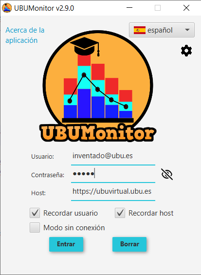

Inicio de sesión
================

Una vez arrancada la aplicación se mostrará la pantalla de inicio de sesión. La ventana muestra en la parte superior la versión actual del producto. La información de la aplicación a la izquierda (*Acerca de la aplicación+) y a la derecha permite seleccionar el idioma de preferencia y ajustar la configuración de la aplicación del lanzador. 

  
  Inicio de sesión
  
A continuación se deben introducir las credenciales de **Usuario** y **Contraseña** en Moodle. 

**MUY IMPORTANTE:** la aplicación **NUNCA** almacena de forma persistente, ni renvía a otros servidores, el *password* del usuario, por motivos de seguridad. El código fuente está disponible para su auditoria y se puede comprobar qué datos y a qué servidor se envían, con un software de análisis de red o *sniffer* (e.g.  Wireshark, Microsoft Message Analyzer, Tcpdump, etc.).

Modo conectado
--------------

En el campo **Host** se debe indicar la URL de la página web de la plataforma Moodle elegida. A la hora de introducir el host, se debe incluir su URL. El protocolo de acceso es opcional, ya que si no se incluye la aplicación **autocompleta** y prueba a conectar con https:// y http:// (en ese orden). 

Por ejemplo:

* para acceder al servidor de pruebas Mount Orange School se pondrá literalmente: ``https://school.moodledemo.net`` o bien  ``school.moodledemo.net``.
* para acceder al servidor Moodle de la UBU (UBUVirtual) se pondrá literalmente: ``https://ubuvirtual.ubu.es`` o bien ``ubuvirtual.ubu.es``.

Se recomienda siempre acceder a servidores seguros (con https://) para garantizar que el envío de información vaya encriptado.

Sin embargo, UBUMonitor permite acceder a cualquier servidor Moodle que valide usuarios de la forma login/password. Si el servidor al que se accede NO es seguro y no encripta la comunicación (con http:// en lugar de https://), se muestra con un icono y *tooltip* adicional el aviso al usuario. Se recomienda utilizar esta opción con prudencia y **solo en accesos a un servidor local de confianza**.

.. figure:: images/Login_no_seguro.png
  :width: 400
  :alt: Login no seguro
  :align: center
  
  Inicio de sesión no seguro

La aplicación **recuerda** las *urls* de los servidores que se han utilizado **previamente**, sugiriendo de manera predictiva dichas *urls*.

  
  Surgerencia de hosts usados previamente

Por comodidad, se da la opción de **Recordar usuario** y **Recordar host**, evitando tener que volver a rellenar los campos en siguientes accesos. Esa información se guarda en un fichero ``configuration.json`` en el directorio actual, si marcamos una o ambas opciones. El botón **Borrar** permite eliminar el texto de los tres campos.

Después de introducir las credenciales pulsamos el botón de **Entrar**. Si los datos son válidos cargará la siguiente pantalla, y si no, mostrará un mensaje de error en la zona inferior de la ventana. 

En caso de error no esperado, se recomienda comprobar en este orden:

#. Que la conexión de red está **activa**.
#. Que el *login/password/host* se han tecleado **correctamente** (compruebe que **NO** tiene activado el bloqueo de mayúsculas). 
#. Que el servidor actual está **activo**, accediendo directamente con un navegador.
#. Que su servidor Moodle tiene activos los **servicios web**. Para comprobarlo, intente usar la aplicacion oficial para móviles (ver https://docs.moodle.org/all/es/Moodle_app). Si esta aplicación tampoco funciona, su servidor **NO** permite dicho acceso. Póngase en contacto con su administrador de su servidor Moodle, para consultar la posible activación de **servicios web**. Si está trabajando con una instalación local, active los servicios web siguiendo las instrucciones en https://docs.moodle.org/38/en/Using_web_services.

Si los problemas persisten, una vez comprobado lo anterior, contactar con los autores de la aplicación para notificar el error.

Modo offline
------------

Adicionalmente, si se selecciona la casilla **Modo offline**, la aplicación puede trabajar **sin conexión a red**. 

  
  Modo offline seleccionado

Esto permite trabajar, incluso con el servidor Moodle no disponible o caído. El único requisito es que **previamente** se hayan descargado los datos de las asignaturas en la caché local, en anteriores sesiones de trabajo con **conexión a a red**. 

Aun así, sigue siendo necesario introducir el usuario, contraseña y url del *host*, puesto que los datos se localizan y desencriptan a partir de dichos valores garantizando siempre el acceso seguro a los datos locales. 

  
  