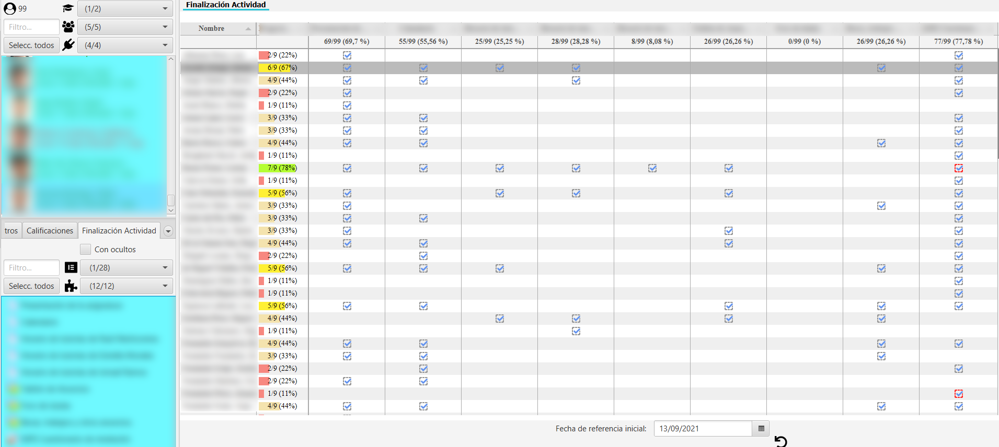

Visualización de finalización de actividad
==========================================

La finalización de actividades muestra el estado actual de cada actividad, sobre la que se ha activado el rastreo. 

Para cada actividad se muestra su estado, con un stick verde si está completada, con un aspa roja si se ha realizado, pero no superado, y en blanco si no se ha realizado. Si posicionamos el cursor en cualquiera de las casillas, se muestra en un *tooltip* la fecha y hora de finalización.

  
  Tabla de finalización de actividades
  
  
En la última columna se muestra el progreso del número de actividades para cada usuario, con el número completado del total y el porcentaje. La barra de progreso se colorea en función del porcentaje (i.e. en la configuración por defecto se tiene rojo < 25%, salmón entre [26%, 50%), amarillo entre [50%, 75%), verde claro entre [75%, 99%) y verde oscuro para 100%).

En la cabecera de cada columna se muestra el número de usuarios que han completado la actividad y el porcentaje sobre el total de usuarios.

Se puede aplicar el **filtro por fechas** para visualizar solo la finalización de actividades dentro del rango marcado, permitiendo visualizar la **instantánea concreta en un momento particular de tiempo**. 

Se permite la ordenación alfabetica, temporal o numéricamente según sea la columna de nombre, item o porcentaje respectivamente.

**MUY IMPORTANTE**: para mostrar esta tabla es necesario activar en Moodle, en **Editar ajustes** del curso, en el apartado **Rastreo de finalización**, la opción **Habilitar rastreo del grado de finalización**. Una vez realizado ese cambio se recomienda ajustar la opción **Finalización de actividad** para cada actividad y recurso, si se quieren recoger y visualizar los datos de rastreo.