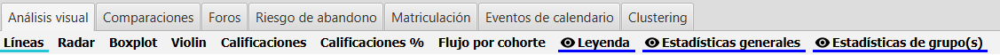
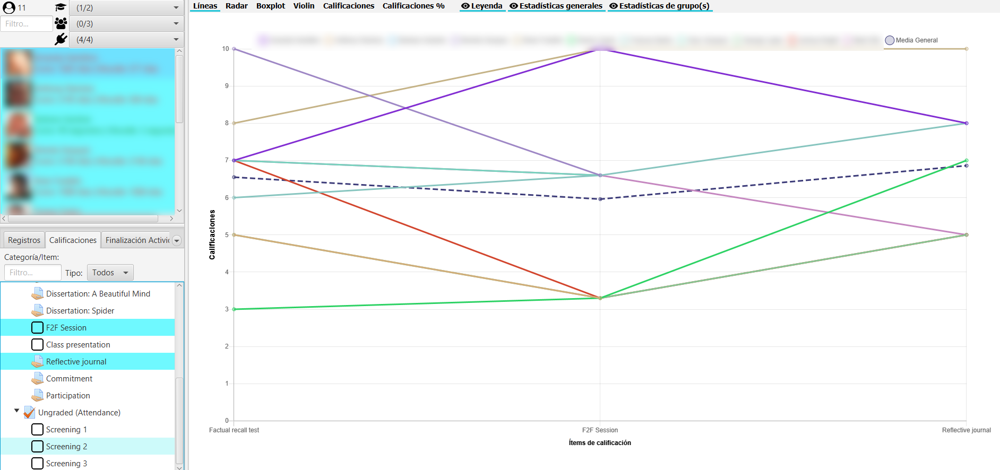
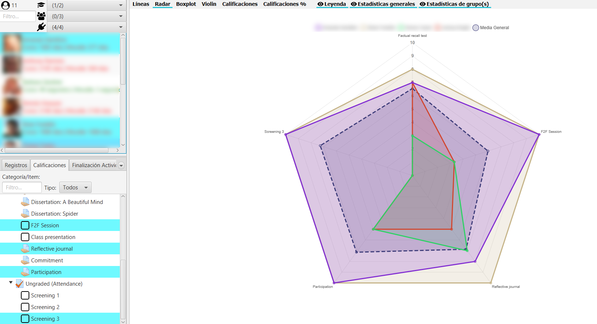
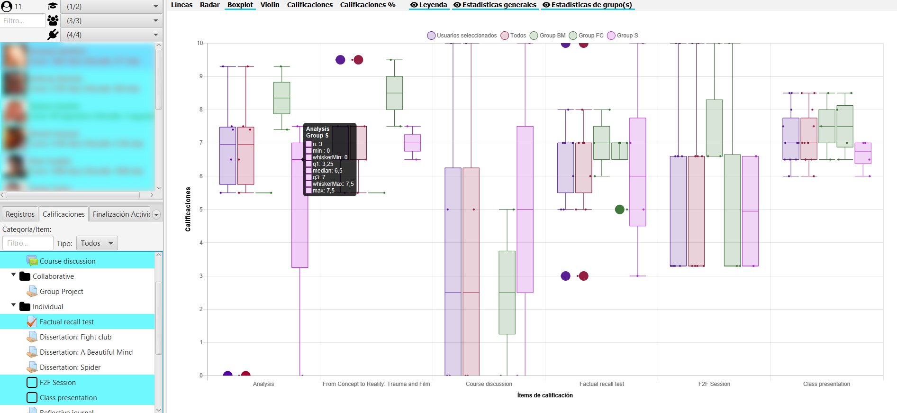
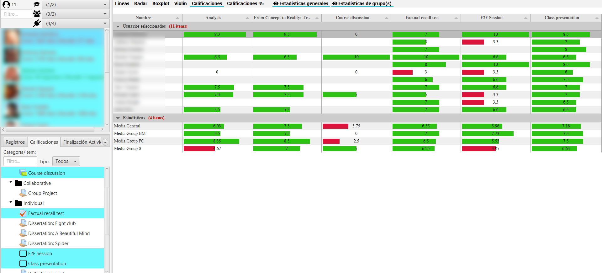

Visualización de calificaciones
===============================

En la esquina inferior izquierda, en la pestaña de **Calificaciones**, se muestra la jerarquía del calificador junto con sus filtros. Es de selección múltiple. En cualquier momento se puede desplegar y hacer más grande esta zona para ver mejor los nombres de los elementos de calificación.

  
  Visualización del calificador
  
La vista muestra el equivalente al calificador configurado en Moodle. Existe dos tipos de filtros que se usan de modo conjunto:

* **Campo de texto**: por nombre del elemento del calificador.
* **Selector de tipo**: según el tipo que sea  (foro, tarea, cuestionario, etc.)

Una vez seleccionada la pestaña **Calificaciones**, en la zona central, en la parte superior aparecen botones para seleccionar el tipo de gráfico a mostrar y para ocultar/mostrar la leyenda, estadísticas generales y estadísticas de grupos.

  
  Barra de herramientas de calificaciones
  
Se debe tener en cuenta que los **items no calificados** (con calificación "-") **no computan** para cálculo de las medias, ni en la generación de gráficos de tipo boxplot ni violín.

Indicar además que en los gráficos de líneas, radar y tabla de calificaciones, al hacer click sobre los puntos o elementos de un alumno concreto sobre el gráfico, se posiciona a su vez en el listado en el usuario correspondiente, para facilitar su identificación.

Gráfico de líneas
-----------------

Muestra un gráfico de líneas donde se representan las notas de los alumnos, reescaladas al rango [0, 10], para cada elemento del calificador seleccionado.

  
  Gráfico de líneas

Gráfico de radar
----------------

Gráfico de tipo radar o también conocido como diagrama de araña o Kiviat. Muy útil para comparar dos o más participantes del curso, en los distintos ejes correspondientes a items o categorías de calificación.

  
  Gráfico radar
  
Se colorea en rojo la zona del radar inferior al 5, y en verde la zona del radar igual o mayor que 5.

Gráfico de boxplot
------------------

Muestra la información de un boxplot o diagrama de caja y bigotes con las calificaciones de todos los alumnos. En este gráfico podemos ver los máximos, mínimos, la mediana, cuartiles primero y tercero, y ouliers si existiesen.

  
  Gráfico de BoxPlot general

Si seleccionamos un usuario particular, muestra sus calificaciones sobre el diagrama.

Gráfico de boxplot de grupos
-----------------------------

Muestra la misma información que el gráfico anterior pero para los grupos de la asignatura. 

  
  Gráfico BoxPlot de grupos

Si seleccionamos un usuario particular, muestra sus calificaciones sobre el diagrama.

Gráfico de violín
-----------------

Muestra un gráfico de violines para las calificaciones de todos los alumnos y del conjunto de alumnos seleccionados, si los hubiera. Adicionalmente si se han filtrado los alumnos por grupo, también muestra el gráfico de violín para dicho grupo. En el gráfico de violines se representa la mediana como un diamante más grueso.

  
  Gráfico de violín general
  
Si seleccionamos un usuario particular, muestra sus calificaciones sobre el diagrama.

Gráfico de violines de grupos
-----------------------------

Muestra un gráfico de violines para las calificaciones de todos los alumnos y de cada uno de los grupos en la asignatura. En el gráfico de violines se representa la mediana como un diamante más grueso.

  
  Gráfico de violines de grupos
  
Si seleccionamos un usuario particular, muestra sus calificaciones sobre el diagrama.

Tabla de calificaciones
-----------------------

Muestra una tabla con las calificaciones, así como la media general y la media de cada uno de los grupos del curso. La tabla permite ordenar alfabéticamente o numéricamente, en orden ascendente o descendente, pulsando alternativamente sobre el título de columna.

Los datos se presentan escalados en el intervalo [0, 10] con una barra horizontal proporcional a la calificación. Se toma como nota de corte el 5, mostrando en rojo aquellos valores que no alcanzan dicha nota, y en verde los valores iguales o mayores.

  
  Tabla de calificaciones con medias de grupos y general

Los datos se presentan agrupados en dos bloques de alumnos y estadísticas que pueden contraerse o expandirse.

