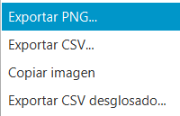
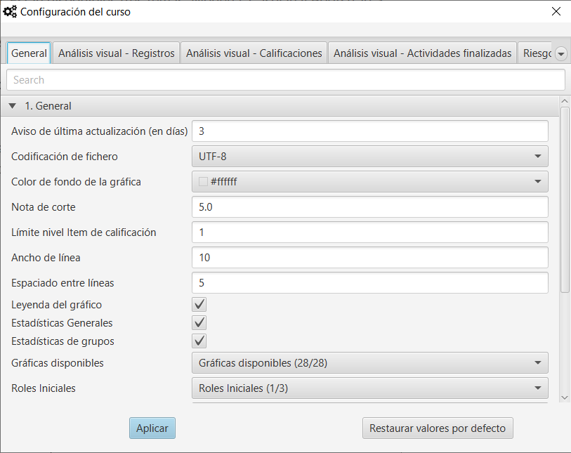
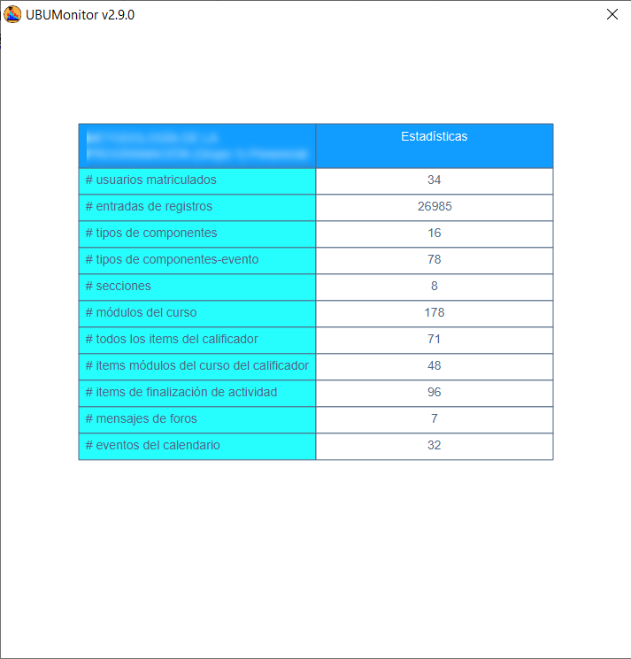
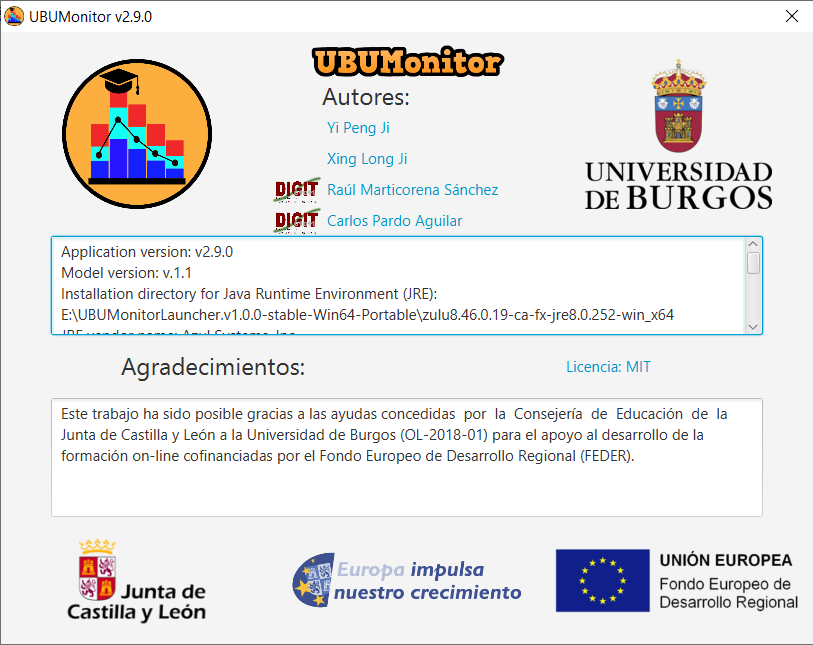
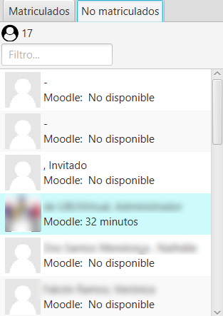
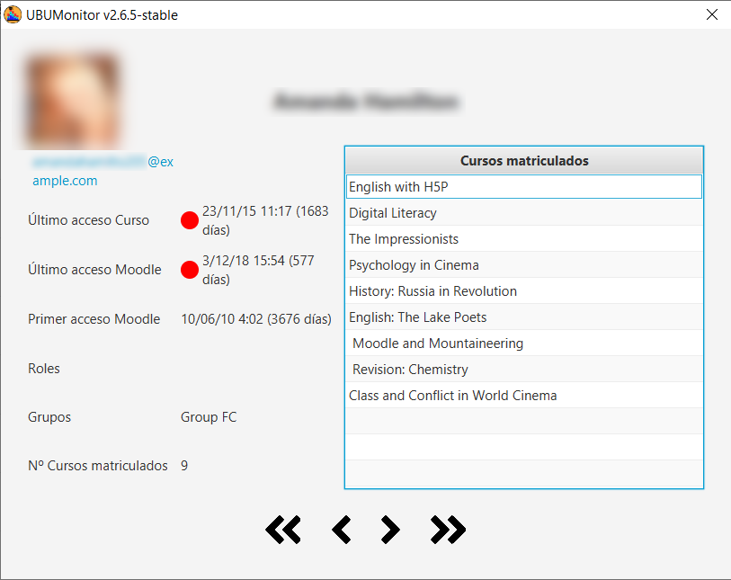

Pantalla principal
==================

La pantalla principal se divide en:

* En la zona superior en la *barra de menú*, los diferentes menús existentes . 
* En la esquina superior izquierda, la *lista de usuarios matriculados* incluyendo número y filtros por rol, grupo y fecha de última actualización.
* En la esquina inferior izquierda, la selección de registros, calificaciones o finalización de actividad.
* En la zona central los distintos gráficos y filtro activos, según la selección previa. 
* En la esquina superior derecha la foto del usuario actual. Se dispone de un menú contextual para ver su nombre, cerrar sesión en el servidor o salir de la aplicación.
* En la zona inferior izquierda se muestra un botón de modo de conexión (verde para online vs. rojo para offline), el nombre de las asignatura cargada y el host al que estamos actualmente accediendo. 
* En la zona inferior derecha se muestra la fecha y hora de última actualización de los datos locales que se están mostrando.

.. figure:: images/Ventana_principal_de_inicio.png
  :width: 600
  :alt: Ventana principal de inicio
  :align: center
  
  Ventana principal de inicio
 
 
En las vistas de usarios y de registros/calificaciones y actividades, se permite la selección múltiple de varios elementos sueltos, manteniendo pulsada la tecla ``Control`` mientras se seleccionan con el ratón, y de elementos contiguos pulsando la tecla ``Mayus``. Con la combinación ``Ctrl`` + ``A`` se seleccionan todos los elementos de la vista.

En los gráficos y tablas generados en la zona central, se habilita siempre un menú contextual (con botón derecho del ratón), permitiendo la **exportación de los datos** en:

* Formato gráfico ``PNG``.
* Formato texto ``CSV``.
* Formato texto ``CSV`` desglosando los datos (si está disponible dicha opción)

  
  Menú contextual de exportación

**Nota**: muchas capturas de pantallas de este manual se han realizado contra los datos del servidor gratuito **Mount Orange School** disponible en https://school.moodledemo.net. Nuestro agradecimiento y reconocimiento al grupo de desarrollo de Moodle que nos ha dado su visto bueno.
  
Barra de menú 
---------------------

En la parte superior de la ventana muestra una barra de menú con diferentes opciones. Se habilita el acceso rápido con atajos de teclado presionando la tecla ALT:

.. figure:: images/Barra_de_herramientas.png
  :width: 400
  :alt: Barra de menú
  :align: center
  
  Barra de menú

**Archivo**

* **Cambiar curso**: cierra la ventana actual y vuelve a la ventana de **Selección del curso​**.

* **Actualizar curso**: descarga los registros más recientes y actualiza las calificaciones y la finalización de actividades del curso actual, a través de la red. Esta opción no está disponible en modo *offline*.

* **Exportar datos CSV**: exporta los datos del curso actual, en formato ``.csv`` a la carpeta seleccionada. Genera los siguientes 8 ficheros:

   * ``course_modules.csv``: contiene los módulos de curso.
   * ``courses.csv``: información de los cursos en los que están matriculados los alumnos matriculados.
   * ``enrolled_users.csv``: alumnos matriculdos.
   * ``grades.csv``: calificaciones.
   * ``groups.csv``: grupos.
   * ``logs.csv``: registros completos.
   * ``roles.csv``: roles activos.
   * ``sections.csv``: secciones del curso.
   
* **Exportar fotos de los usuarios seleccionados...**: genera un documento con las fotos de los usuarios seleccionados. Se ofrecen dos opciones: incluyendo la fotos (opción *Con fotos de usuarios...*) o bien creando una plantilla con huecos pero con nombres, en la opción *Con foto por defecto...*). Estos documentos se pueden utilizar para controles de asistencia, o control de firmas en la opción con foto por defecto.

* **Exportar dashboard**: genera una hoja de cálculo Excel (**.xlsx solo compatible para versiones de Excel 2013 o superiores**) que incluye hojas con la información general, de registros y calificaciones de los alumnos. La hoja es dinámica, permitiendo la consulta y filtrado de datos, en una forma similar de trabajo (pero no igual) a la que se realiza con UBUMonitor.

* **Cerrar sesión**: cierra la sesión actual y vuelve a la pantalla de inicio de sesión.

* **Salir**: cierra la aplicación.

**Editar**

* **Borrar selección**: elimina la selección actual de todas las vistas disponibles.

**Ver**

* **Temas**: permite seleccionar distintos temas de visualización cambiando el aspecto de la aplicación. Están disponibles tres temas: Modena, Caspian y Bootstrap 3. 

**Herramientas**

* **Cambiar configuración**: permite personalizar opciones de funcionamiento y visualización generales y particulares de cada tipo de gráfico generado. Una vez seleccionados los cambios pulsar en el botón de cierre de ventana (los cambios se aplican automáticamente). Si se selecciona el botón **Restaurar valores por defecto** se recuperan los valores iniciales configurados en la aplicación.

  
  Configuración la aplicación
  
* **Importar configuración**: permite importar una configuración previamente almacenada por el usuario para una asignatura.
* **Exportar configuración**: exporta las opciones actuales configuradas en la asignatura por el usuario.

**Ayuda**

* **Estadísticas del curso**: muestra un breve resumen de los datos actuales de la asignatura como el número de usuarios, número de logs, etc.

  
  Estadísticas básicas de la asignatura cargada
  
* **Manual de usuario**: abre el enlace al manual de usuario correspondiente a la versión utilizada en el navegador por defecto.  
* **Más información**: abre el proyecto GitHub en la ventana del navegador por defecto.
* **Acerca de la aplicación**: muestra la información general de la aplicación relativa a versión, autores y agradecimientos.

  
  Información acerca de la aplicación

Listado de usuarios matriculados/no matriculados
------------------------------------------------

En esta vista se muestra el listado de los usuarios matriculados, junto con su fotografía y el tiempo desde su último acceso al curso actual y a la plataforma de Moodle, ya sea en minutos, horas o días. Se toma como referencia la hora del sistema.

.. figure:: images/lista_usuarios_matriculados.png
  :width: 300
  :alt: Lista de usuarios matriculados
  :align: center
  
  Lista de usuarios matriculados
  
Los usuarios se colorean, según su fecha de última conexión al curso, para facilitar la detección de **riesgo de abandono**, utilizando la siguiente codificación:

* *Rojo*: si hace más de 13 días que no se conecta.
* *Amarillo*: si se ha conectado entre 7 a 12 días.
* *Azul*: si se ha conectado hace 3 a 6 días.
* *Verde*: si se ha conectado en los últimos 2 días.

También da la opción de aplicar cuatro filtros juntos de forma conjunta, con selección múltiple:

* **Campo de texto**: filtrar el listado por nombre y/o apellidos.
* **Selector de Rol**: seleccionar el rol por el que se quiere filtrar (e.g. estudiante, profesor, profesor no editor, etc.)
* **Selector de Grupo**: grupo por el que se quiere filtrar.
* **Selector de Última conexión**: franja de último acceso.

En la esquina superior izquierda, se muestra el número de participantes que cumplen los filtros aplicados.

En la segunda pestaña se muestran los usuarios **no matriculados**, de los cuales se han recogido accesos (o logs), pero no están o han dejado de estar matriculados en la asignatura. En este caso, la informacion disponible puede ser mucho más limitada y solo se dispone de información de los registros y sus gráficos asociados. Se deshabilitan las opciones de filtrado de calificaciones y finalización de actividades.

  
  Lista de usuarios no matriculados

Ficha de alumnos
----------------

Si seleccionamos con el botón derecho un alumno, aparece un menú contextual *Ver <nombre de usuario>* que lanza un diálogo para mostrar la ficha del alumno/a. 

  
  Ficha de alumnos
  
En dicha ficha se muestran: nombre, apellidos, email, fechas de último acceso a la asignatura y a Moodle, fecha de primer acceso a Moodle, roles, grupos y número de cursos/asignaturas en los que está matriculado/a. 

Se utilizan círculos de color para indicar la fecha de última conexión a la asignatura, o a Moodle, con el mismo criterio visto previamente en el listado de usuarios matriculados (i.e. rojo, amarillo, azul o verde).

En la zona derecha, se muestra el listado completo de cursos en los que está matriculado/a. El listado se muestra ordenado por identificador, pero se puede ordenadar alfabéticamente en orden ascendente o descendente, pulsando sobre **Cursos matriculados**.

Los botones en la parte inferior con flechas a izquierda y derecha permiten avanzar o retroceder en el listado de alumnos, actualizando los datos. Los botones con dobles fechas, permiten ir al último o primer alumno/a en la lista.