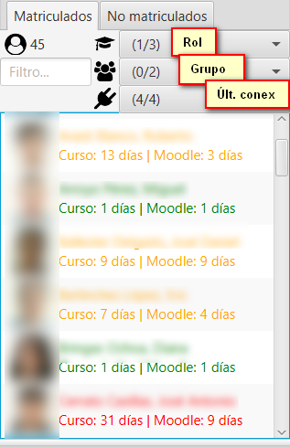

Pantalla principal
==================

En esta ventana principal se muestra los diferentes menús existentes, la lista de usuarios matriculados, la selección de calificaciones/registros y las opciones de visualización de diferentes gráficos. Combinando dicha selección de usuarios con las pestañas de calificaciones y registros, se activan y desactivan los tipos de gráficos y los filtros adicionales a aplicar.

.. figure:: images/Ventana_principal_de_inicio.png
  :width: 600
  :alt: Ventana principal de inicio
  :align: center
  
  Ventana principal de inicio

**Nota**: muchas capturas de pantallas de este manual se han realizado contra los datos del servidor gratuito **Mount Orange School** disponible en https://school.moodledemo.net. Nuestro agradecimiento y reconocimiento al grupo de desarrollo de Moodle que nos ha dado su visto bueno.
  
Barra de herramientas 
---------------------

En la parte superior de la ventana muestra una barra de herramientas con diferentes opciones:

.. figure:: images/Barra_de_herramientas.png
  :width: 800
  :alt: Barra de herramientas
  :align: center
  
  Barra de herramientas

**Archivo**

* **Cambiar asignatura**: cierra la ventana actual y vuelve a la ventana de **Elección del curso​**

* **Actualizar curso**: descarga los registros más recientes y actualiza las calificaciones del curso actual, a través de la red.

* **Guardar gráfico como...**: permite guardar en formato ``.png`` el gráfico actual mostrado en la aplicación.

* **Exportar datos CSV**: exporta los datos del curso actual, en formato ``.csv``. Los ficheros resultantes se dejan en el subdirectorio ./export. Genera los siguientes 8 ficheros:

   * ``course_modules.csv``: contiene los módulos de curso.
   * ``courses.csv``: información de los cursos en los que están matriculados los alumnos matriculados.
   * ``enrolled_users.csv``: alumnos matriculdos.
   * ``grades.csv``: calificaciones.
   * ``groups.csv``: grupos.
   * ``logs.csv``: registros completos.
   * ``roles.csv``: roles activos.
   * ``sections.csv``: secciones del curso.

* **Cerrar sesión**: cierra la sesión y vuelve a la pantalla de inicio.
* **Salir**: cierra la aplicación.

**Editar**

* **Borrar selección**: quita la selección de todas las vistas disponibles.

**Ayuda**

* **Acerca de la aplicación**: abre en la ventana del navegador el proyecto GitHub.

En la parte superior, también muestra los datos del usuario actual, el curso seleccionado, la URL de la plataforma de Moodle (host) y la fecha/hora de última actualización del curso actual.

Listado de usuarios matriculados
--------------------------------

En este apartado se muestra el listado de los usuarios matriculados en el curso, junto con su fotografía y el tiempo desde su último acceso al curso actual y a la plataforma de Moodle ya sea en minutos, horas o días. Se toma como referencia la hora del sistema.

  
  Lista de usuarios matriculados
  
Los usuarios se colorean, según su fecha de última conexión al curso, para facilitar la detección de **riesgo de abandono**, utilizando la siguiente codificación:

* *Rojo*: si hace más de 13 días que no se conecta
* *Amarillo*: si se ha conectado entre 7 a 12 días.
* *Azul*: si se ha conectado hace 3 a 6 días.
* *Verde*: si se ha conectado en los últimos 2 días.

Se permite la selección múltiple de varios usuarios sueltos, manteniendo pulsada la tecla <Control> mientras se seleccionan con el ratón y usuarios contiguos pulsando la tecla <Mayús>. Con la combinación <Ctrl+A> se seleccionan todos los usuarios.

También da la opción de aplicar cuatro filtros juntos de forma conjunta:

* **Campo de texto**: filtrar el listado por nombre y/o apellidos.
* **Selector de Rol**: seleccionar el rol por el que se quiere filtrar (e.g. estudiante, profesor, profesor no editor, etc.)
* **Selector de Grupo**: grupo por el que se quiere filtrar.
* **Selector de Última conexión**: franja de último acceso.

En la esquina superior izquierda, se muestra el número de participantes que cumplen los filtros aplicados.