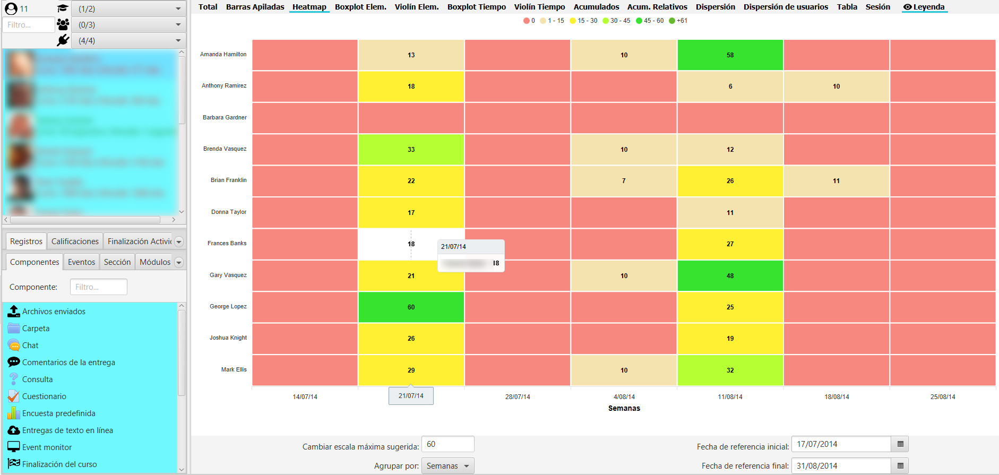
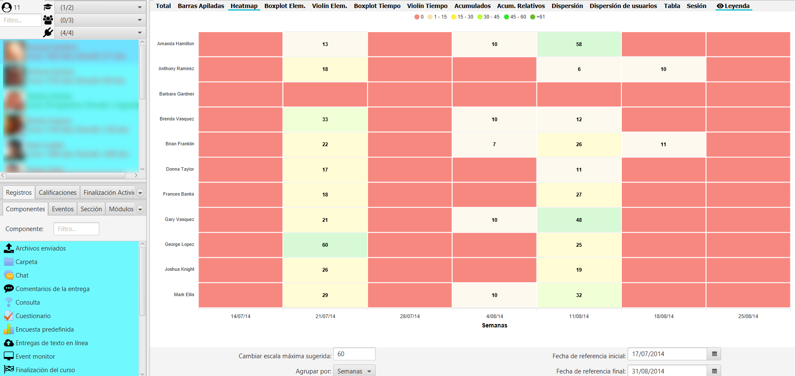

Visualización de registros
==========================

Opciones de los registros
-------------------------

Al pulsar la pestaña de **Registros**, en la esquina inferior izquierda, aparecen varias opciones de filtrado en la zona inferior de la pantalla principal.

.. figure:: images/OpcionesRegistros.png
  :width: 600
  :alt: Filtro de registros
  :align: center
  
  Filtro de registros
  
* **Cambiar escala máxima sugerida**: permite modificar la escala máxima del eje Y. Se actualiza el valor al cambiar los componentes y/o eventos seleccionados o las otras opciones. Aporta información útil también al mostrar que existe un usuario con esa escala.
* **Agrupar por**: agrupa los registros en diferentes formas

   * Horas
   * Días
   * Días de la semana
   * Semanas 
   * Meses
   * Todos
   
* **Fecha de referencia inicial**: la fecha de inicio orientativo que se muestra al agrupar. Inicialmente toma el valor de la configuración de la asignatura en Moodle.
* **Fecha de referencia final**:  fecha límite orientativa que se muestra al agrupar. Inicialmente se toma como fecha fin el mínimo de la fecha actual y la fecha de fin de curso si existe.

Hay que tener en cuenta que la fecha de referencia incial y final no toman todos los datos al realizar las agrupaciones. Por ejemplo al agrupar por meses y una fecha inicial del 17/06/2019 a 24/06/2019 no mostrará los registros entre esos dos días, si no que mostrara todas las de junio.

En las agrupaciones por **Horas** y **Días de la semana** no usan el selector de fechas, calculándose sobre el total de registros, por lo tanto se deshabilitan.

En los gráficos al hacer click sobre los puntos o elementos de un alumno concreto, se posiciona a su vez en la vista en el usuario correspondiente, para facilitar su identificación. Se dispone de la ficha del alumno/a para poder consultar información adicional.

En la zona izquierda inferior se muestran las posibles pestañas de selección de elementos sobre los que generar las gráficas: **Componentes**, **Eventos**, **Secciones** o **Módulos de curso**. Se permite selección múltiple sobre todos ellas y el filtrado por texto.

Componentes
-----------

Lista los registros del curso en función del tipo de **Componente**. Incluye las actividades y recursos típicos en Moodle, y adicionalmente alguno generado por la actividad particular sobre el curso. Solo se visualizan componentes que hayan generado los usuarios matriculados en el curso actual.

.. figure:: images/ListaComponentes.png
  :width: 300
  :alt: Lista de componentes
  :align: center
  
  Lista de componentes
  
Eventos
-------

Lista los registros del curso en función del **Componente y Evento** que sea. Se muestran solo los componentes y eventos generados por los usuarios actuales matriculados en el curso. Básicamente desglosa los tipos de eventos que se producen sobre los componentes.

.. figure:: images/ListaEventos.png
  :width: 300
  :alt: Lista de eventos
  :align: center
  
  Lista de eventos
  
Sección
-------

Muestra la estructura de secciones en la que se encuentra organizado el curso, en el mismo orden que tengan en el curso. En la práctica, se corresponden habitualmente con temas o semanas. Inicialmente se muestran solo las secciones visibles pero seleccionando **Con ocultos**, se muestran todas.

  
  Lista de secciones
  
Módulos de curso
----------------

Muestra el conjunto completo de módulos de curso, incluyendo todos los recursos y actividades que se han creado. Se muestran ordenados tal y como se encuentran en la asignatura. Inicialmente se muestran solo los módulos visibles pero seleccionando **Con ocultos**, se muestran todos. También es posible filtrar solo aquellos módulos que tienen activo el rastreo de finalización, marcando la casilla **Act.Complet**. Se permite el filtrado con selección múltiple, según el tipo de módulo.

.. figure:: images/ListaModulos.png
  :width: 300
  :alt: Lista de módulos
  :align: center
  
  Lista de módulos

Gráfico de barras apiladas
--------------------------

Muestra en barras apiladas el número de registros para cada uno de los usuarios seleccionados. Se utilizan diferentes colores para cada uno de los elementos. También se apilan las líneas que indican el valor medio de los usuarios filtrados en ese momento.

.. figure:: images/GraficoBarrasApiladas.png
  :width: 600
  :alt: Grafico de Barras Apiladas
  :align: center
  
  Gráfico BarrasApiladas

Si se coloca el cursor sobre una barra apilada, se muestra en un *tooltip*, la identidad del alumno y el desglose de valores.

Si se ajusta el valor máximo en **Cambiar escala máxima sugerida:** se recalcula y ajusta el máximo en el eje Y.
  
Gráfico de HeatMap
------------------

Muestra un "mapa de calor" para los usuarios seleccionados. El mapa de calor colorea desde rojo hacia verde, de menor a mayor intensidad, en relación al número de accesos del usuario a los elementos seleccionados y con la selección de filtro de la zona inferior. 

  
  Gráfico de HeatMap
  
Si presionamos en el gráfico sobre la leyenda superior en un intervalo, por ejemplo en  el valor cero, se resaltan en el gráfico dichos valores situados en dicho intervalo, facilitando por ejemplo, la detección de alumnos en riesgo de abandono o en otras situaciones.
 

  
  Gráfico de HeatMap resaltando intervalo seleccionado
  
Si se ajusta el valor máximo en **Cambiar escala máxima sugerida:** se recalcula y ajusta la paleta de colores.

Gráfico de registros acumulados
-------------------------------

Muestra el valor acumulado del número de registros, a lo largo del tiempo. Se incluye el valor medio para comparar con un línea discontinua. Permite mostrar la evolución a lo largo del curso del número de accesos por cada alumno y compararlo con el resto.

  
  Gráfico de registros acumulados

Gráfico de registros relativos
------------------------------

Muestra el valor acumulado del número de registros respecto del valor medio como referencia, a lo largo del tiempo. La medía como línea de referencia se corresponde siempre con la línea discontinua roja en el punto cero. Permite mostrar la evolución relativa a la media a lo largo del curso.

  
  Gráfico de registros acumulados relativos a la media

Gráfico de dispersión
---------------------

Muestra la distribución temporal de los registros a lo largo del tiempo de cada usuario seleccionado. Representa la distribución temporal de los distintos accesos a simple golpe de vista, facilitando su comparación.

  
  Gráfico de dispersion

Gráfico de totales
------------------

Muestra el total de número de registros de los usuarios filtrados en un periodo de tiempo sobre lo elementos seleccionados. Permite la comparación de accesos entre elementos de forma directa. 

  
  Gráfico de totales
  
Si seleccionamos grupos, se muestran sus totales, teniendo en cuenta el filtro por rol. Adicionalmente se pueden seleccionar usuarios sobre la lista de filtrados, para visualizar los totales sobre dicho grupo ficticio.